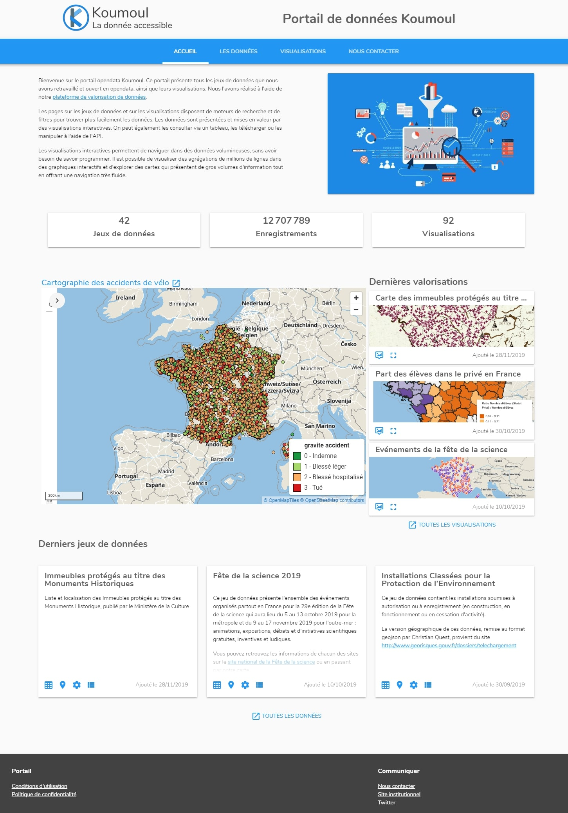

La page d'accueil est le point d’entrée principal du portail de données.
Elle présente les derniers jeux de données ajoutés et les dernières visualisations réalisées.

Le portail permet de mettre en avant du contenu éditorial (texte expliquant la démarche ou présentant le portail) et une visualisation mise en avant.

</img>
