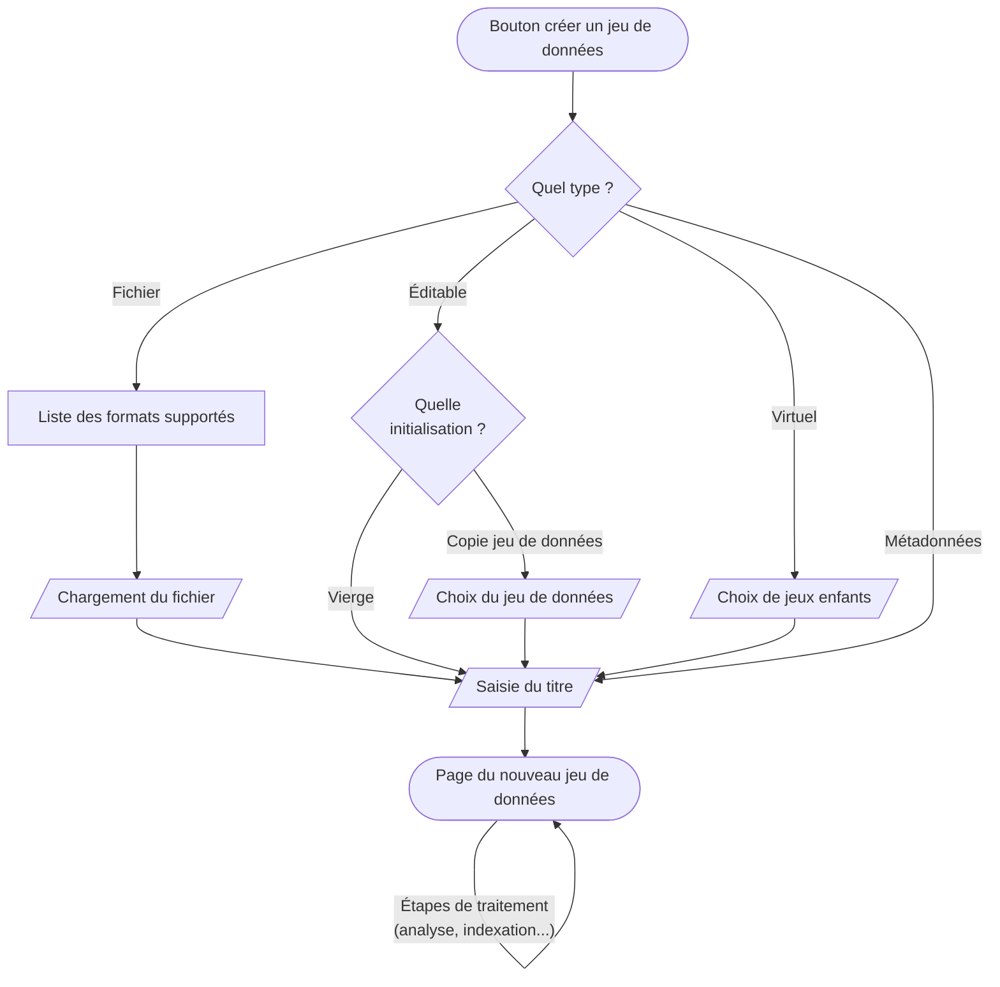
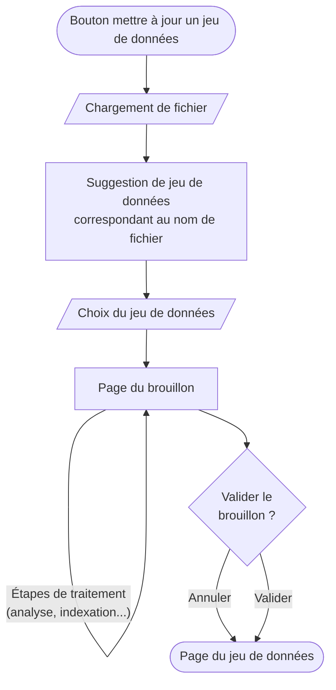

Pour améliorer et encadrer l'expérience des contributeurs des parcours standards leurs sont proposés.

## Créer un jeu de données

```mermaid
flowchart TD
  start([Bouton créer un jeu de données]) --> type{Quel type ?}
  type -- Fichier --> format[Liste des formats supportés]
  format --> file[/Chargement du fichier/]
  file --> title
  type -- Éditable --> restInit{Quelle<br>initialisation ?}
  restInit -- Vierge --> title[/Saisie du titre/]
  restInit -- Copie jeu de données --> restDataset[/Choix du jeu de données/]
  restDataset --> title
  title --> dataset([Page du nouveau jeu de données])
  type -- Virtuel --> virtualChildren[/Choix de jeux enfants/]
  virtualChildren --> title
  type -- Métadonnées --> title
  dataset -- "Étapes de traitement<br>(analyse, indexation...)" --> dataset
```

## Mettre à jour un jeu de données

```mermaid
flowchart TD
  start([Bouton mettre à jour un jeu de données]) --> file[/Chargement de fichier/]
  file --> suggest[Suggestion de jeu de données<br>correspondant au nom de fichier]
  suggest --> choseDataset[/Choix du jeu de données/]
  choseDataset --> datasetDraft[Page du brouillon]
  datasetDraft -- "Étapes de traitement<br>(analyse, indexation...)" --> datasetDraft
  datasetDraft --> draftValidate{Valider le<br>brouillon ?}
  draftValidate -- Annuler --> dataset([Page du jeu de données])
  draftValidate -- Valider --> dataset
```