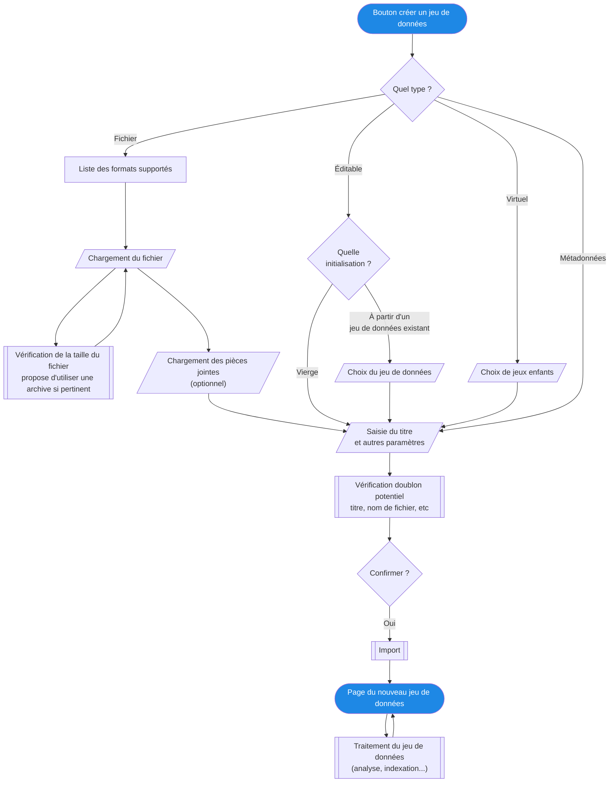

Pour améliorer et encadrer l'expérience des contributeurs des parcours standards leurs sont proposés.

## Créer un jeu de données



## Mettre à jour un jeu de données


### Partager un jeu de données sur un portail

```mermaid
flowchart TD
  start([Bouton partager un jeu de données]) --> choseDataset[/Choix du jeu de données/]
  choseDataset --> chosePortal[/Choix du portail/]
  chosePortal -- rôle contrib --> fetchRequiredMetadata[[Récupération des métadonnées<br>obligatoires pour ce portail]]
  chosePortal --> rôle admin --> editPermissions[Édition des permissions]
  editPermissions --> fetchRequiredMetadata
  fetchRequiredMetadata --> editMetadata[Édition des métadonnées]
  editMetadata --> confirm{Confirmer ?}
  confirm -- rôle contrib --> publicationRequested[[Demande de publication<br>envoyée aux administrateurs]]
  publicationRequested --> home([Retour à l'accueil])
  confirm -- rôle admin --> publicationSaved[[Enregistrement de la publication]]
  publicationSaved --> datasetPortal([Page du jeu de données dans le portail])

  %% styling
  classDef primary fill:#1E88E5,color:#FFF;
  class start,datasetPortal,home primary;
```