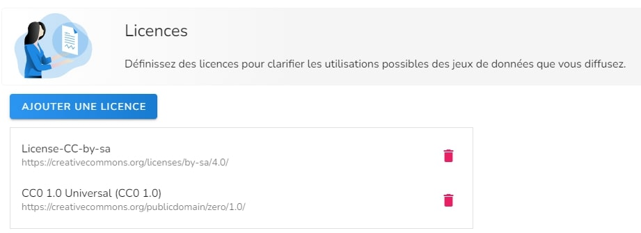
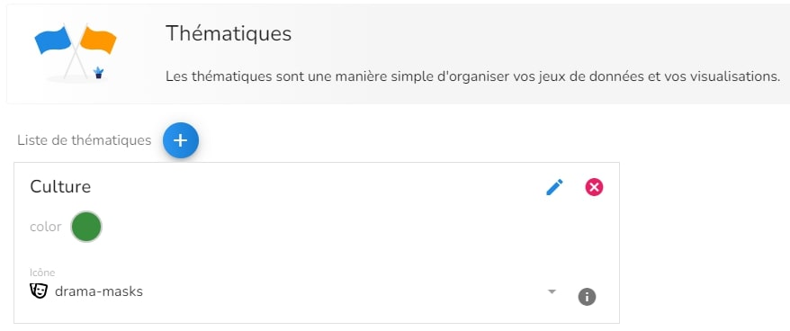

Une licence définit les droits d'utilisation, de partage et d’accès aux données.
Les thématiques permettent de mieux cataloguer les données.

La solution permet de gérer les différentes licences et thématiques dont vous avez besoin pour vos données.

Une licence est définie par son nom et son adresse.

</img>

Une thématique est définie par son nom et sa couleur.

</img>

Les licences et thématiques ajoutées dans votre configuration peuvent ensuite être assignées aux données. Les licences et thématiques de vos données seront disponibles dans votre portail de données.
