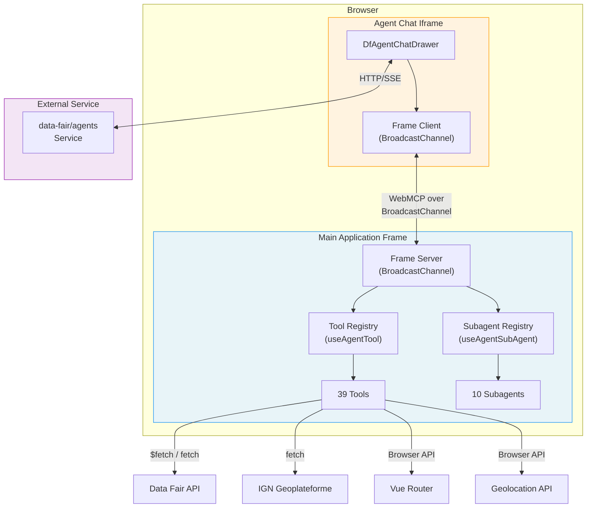
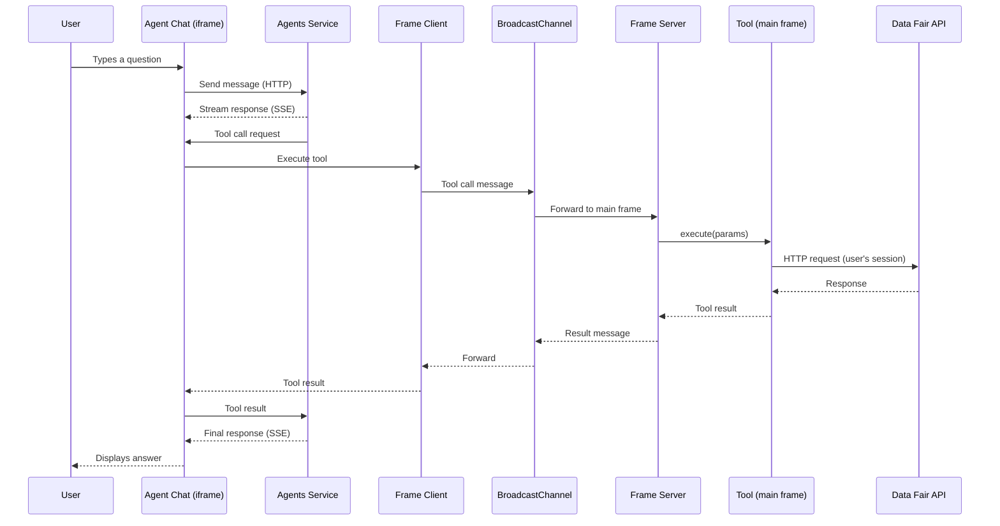
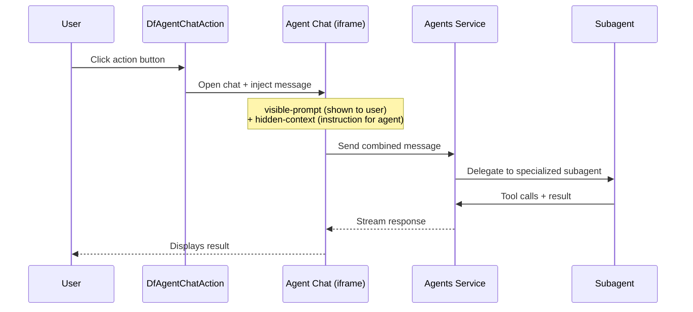

# AI Agent Integration Architecture

## 1. Overview

Data Fair integrates an external AI agents service (`data-fair/agents`) to provide a **back-office assistant** embedded directly in the platform UI. This assistant helps users navigate the interface, explore and query datasets, configure visualization applications, write calculated column expressions, and manage metadata.

The integration follows a **browser-side tool exposure** pattern: the main application frame registers tools and subagents using Vue composables, and the external agents service (running in an iframe) discovers and invokes them via a **WebMCP** protocol over BroadcastChannel.

### Key characteristics

- **Tools execute in the browser**: all tool logic runs client-side in the main application frame, with the user's session and permissions. The agent service never directly accesses the Data Fair API.
- **Bilingual**: all tool annotations, subagent prompts, and the system prompt support French and English.
- **Progressive activation**: the feature is gated behind an environment variable, an organization setting, and responsive UI rules.
- **Read-heavy, write-light**: of 39 tools, only 9 perform writes (navigate, set_expression, set_dataset_summary, set_dataset_description, set_application_summary, set_application_description, set_property_config, open_add_line_dialog, open_edit_line_dialog). These metadata "writes" set the edit-form field client-side — the user still saves. The creation wizard tools manipulate client-side form state only — no server-side writes.

### Activation flow

```
PRIVATE_AGENTS_URL (env var)
  -> config.privateAgentsUrl (API config)
    -> uiConfig.agentsIntegration (boolean flag exposed to frontend)
      -> GET /settings/{type}/{id}/agent-chat (per-account boolean)
        -> showAgentChat (reactive ref in UI)
          -> Tool registration + Chat drawer rendering
```

## 2. Architecture

### Component diagram



### Typical tool call sequence



### Action button flow



## 3. System Prompt

Defined in `ui/src/layouts/default.vue`, locale-dependent. Instructs the agent to be a Data Fair assistant: help navigate, explore datasets, query data, configure applications, manage metadata. Key directives: respond in the user's language, be concise, frequently use `getCurrentLocation`, and use `navigate` to show filtered data after subagent exploration.

### Absolute-URL link convention

Chat prose renders inside the agents iframe, which resolves a clicked link against its *own* URL before the host (`useAgentChatBase`) can act on it — so a relative link the model writes (`/dataset/{id}/table`, or worse a bare `dataset/...`) loses the deployment path prefix (e.g. `/data-fair/`) and the host full-reloads to a 404. Models also resist hand-assembling relative paths and tend to hallucinate an origin. Rather than fight that, the integration hands the model **ready-made absolute URLs** and tells it to use them verbatim:

- `list_pages` emits absolute URLs (origin + history base + path) via `toAbsoluteUrl` — `{id}` templates and a trailing `?<query>` are the only things the model substitutes.
- `get_current_location` returns the current page's absolute `URL`.
- `list_datasets` (now surfaced in its text output) and `describe_dataset` emit a per-dataset `Link`. The shared formatters default this to the API `page` field — the public/portal page, correct for the portal and MCP consumers. **The back-office integration must not use `page`**: on a secondary domain the API rewrites `page` to the portal URL (via the publication site's `datasetUrlTemplate`) or, through the `setResourceLinks` fallback, to the *primary* back-office (`config.publicUrl`) — never the current secondary back-office the user is in. So `useAgentDatasetTools` passes a `datasetLink` option (`agent-tools/{list-datasets,describe-dataset}.ts`) that builds a current-site link (`window.location.origin + $sitePath + /data-fair/dataset/{id}`), overriding both the text `Link` and `structuredContent.page`. The system prompt points at that link as the base for `/table?<filterQuery>` and `/map?<filterQuery>`.
- `navigate` accepts either an absolute URL or a bare path: `toRoutePath` reduces any input (full URL, base-prefixed path, or bare router path — even one with a wrong/hallucinated origin) back to a base-less router path for `router.push`, mirroring the host handler's logic.

Pure helpers live in `ui/src/composables/agent/url-utils.ts` (`toAbsoluteUrl` / `toRoutePath`, unit-tested in `tests/features/agent-tools/url-utils.unit.spec.ts`); the back-office base is `$sitePath + '/data-fair/'` (`ui/src/main.ts`).

## 4. Workflows

### 4.1 Free Chat

The user types directly in the chat drawer. The agent has access to all globally-registered tools (navigation, dataset listing/description, data queries, applications, geolocation, connectors) and can combine them freely.

### 4.2 Explore Dataset Data

| | |
|---|---|
| **Trigger** | Free chat or via filter/quality actions |
| **Subagent** | `dataset_data` — data analyst that queries dataset content |
| **Pattern** | Optimistic exploration: queries directly when the parent already supplied column keys/types (it usually has them from `describe_dataset` or the current page), and only calls `get_dataset_schema` when it lacks column info or needs sample values — relying on the 400 "valid operations" errors to self-correct. Returns a "Context" block for table filtering handoff, including the dataset `slug`. |
| **Tools** | `get_dataset_schema`, `search_data`, `aggregate_data`, `calculate_metric`, `get_field_values` |
| **Source** | `ui/src/composables/dataset/agent-data-tools.ts` |

#### Filter capability discovery (error-driven)

The agent is **not** given a per-column capability list in `get_dataset_schema` (kept lean — it would bloat every exploration with mostly-default boilerplate). Instead it knows the global suffix list (in the `dataset_data` subagent prompt via the shared `filtersGuide`; each filtering tool's `filters` param carries only a terse self-contained stub) and assumes the common defaults. When a filter/sort/group/metric/word-agg call hits a column whose `x-capabilities` forbid it, the API returns a 400 whose message lists the operations that column *does* support (`Opérations disponibles sur ce champ — …`), so the agent self-corrects on the next call.

The capability → operation mapping is a single source of truth: `FILTER_CAPABILITIES` + `getColumnFilters` / `getColumnOperations` / `columnOperationsHint` in `api/src/datasets/es/operations.ts`. It also drives the `commons.js` filter-loop enforcement and the OpenAPI doc generator (`api/contract/dataset-api-docs.ts`).

#### `_c_` prefix disambiguation, ignored-parameter hints, and new 400 validations

**`_c_` prefix is concept-only.** The `_c_` prefix is reserved for concept filters (geo distance, date match, full-text search) that are identified by concept id rather than column key. A column filter normally must not carry this prefix — `ville_eq` is correct, `_c_ville_eq` is the mistake the agent keeps making (copying the pattern from real `_c_` params it sees in live URLs). The `filtersGuide` in `agent-tools/_utils.ts` (embedded once in the `dataset_data` subagent prompt) and the terse `filtersDescription` stub on each filtering tool's `filters` param state this explicitly — those are the surfaces where filters are *actually authored* (the query tools). The main system prompt (`ui/src/layouts/default.vue`) no longer re-teaches the `_c_`/suffix syntax at all: it draws the responsibility boundary instead — **agents never write filter params themselves; only the data tools author filter strings, and everyone else pastes the returned `filterQuery` verbatim** (the one allowed addition is `select=…`). This is deliberately stronger and shorter than the old "reuse verbatim, and don't add `_c_`" wording, which still left room to hand-assemble and only patched one symptom. (That older prompt once wrongly described `filterQuery` as "already _c_-prefixed", which made the orchestrator instruct the subagent to slap `_c_` onto column filters in the presentation layer — past the API's `ignoredParamsAdvice` hint, since the corrupted prefix only ever appeared in the emitted link, never in an actual query.)

**The dropped-operator-suffix variant (and the ownership fix).** The same class recurs without `_c_`: the orchestrator, lacking the suffix rule, hand-authors a filter as `lieu_departement=Finistère` (no `_eq`) — often by *dictating that format to the `dataset_data` subagent in the task*, which then takes the caller's format for granted and emits ready-to-use URLs in it, even though its own `Filter query:` output line correctly read `lieu_departement_eq=…`. A suffix-less key matches no operator in the table/map URL parser and is silently dropped, landing the user on the unfiltered dataset. Fixed by **ownership prompting**, not by a parser tweak: the `subagent_dataset_data` tool description tells the caller to describe the data need *in plain language, not filter/URL syntax*; the subagent prompt makes its verbatim `filterQuery` the only correct filter syntax and forbids hand-assembling `column=value` links even when the task phrased the filter differently. The principle generalizes the `_c_` fix: don't patch each malformed-syntax symptom in the always-present prompt — move authorship to the one agent (and tool output) that has the schema. (A read-side fallback — rewriting a bare `<column>` URL param to `<column>_eq` in `useFilters` — was rejected: it can't be done safely without the schema, and matching bare param keys against schema keys collides with generic column names like `sort`/`select`/`page`.)

**Defensive resolution of mis-prefixed column filters.** Prompt rules alone can't stop the mistake, because it self-perpetuates: a `_c_<col>_<suffix>` that lands in the address bar is echoed back by `get_current_location`, and the model trusts the concrete live URL over the abstract prohibition and re-emits it. The malformed key cannot be normalized at the URL boundary (navigate / get_current_location) without the schema, because `_c_<conceptId>_<suffix>` is a **legitimate, API-accepted concept filter** when `<conceptId>` is a real primary concept — indistinguishable from a mis-prefixed column key without knowing the dataset's columns. So the resolution lives where the schema exists: the ES query parser (`api/src/datasets/es/commons.ts`) resolves a `_c_<x>_<suffix>` key against primary concept ids first and, when none matches, **falls back to a column-key lookup** before the existing silent-ignore (`continue`). A genuine inapplicable dashboard concept filter still matches neither and is ignored as before. This fixes the agent data tools *and* the table/map preview in one place: the table forwards every `_c_*` param straight to the API via `useConceptFilters` (`dataset-table.vue` `extraParams`), so the same fallback applies. The pre-existing always-on `ignoredParamsAdvice` hint still nudges the model toward the bare column form.

**Always-on ignored-parameter hint.** The dataset data API now returns an advisory `hint` string in the response body (suppressed only when `hint=false` is passed) for silently-ignored query parameters: a `_c_`-prefixed column filter (suggests the bare column filter), an inert `_c_` filter that matches no concept, or an unrecognised/misspelled parameter. The advice is generated by `ignoredParamsAdvice` in `api/src/misc/utils/query-advice.ts` and emitted via `attachQueryHint` — independent of the slow-query performance-advice gate. It is wired into `/lines`, `/geo_agg`, `/values_agg`, and `/metric_agg`. The `search_data`, `aggregate_data`, and `calculate_metric` agent tools print the hint in their formatted output so the model can self-correct without a round-trip error.

**New 400 validations.** Three additional cases now return HTTP 400 instead of silently misbehaving: `q_fields` referencing an unknown or non-searchable column (when a full-text query `q` is present), `highlight` on a column with no full-text capability, and `/geo_agg` `metric`/`metric_field` specifying an unknown field, a field missing the `values` capability, or an incompatible metric. All three use the same `columnOperationsHint` "Opérations disponibles sur ce champ — …" format as the rest of the data API, so the agent can read the 400 and self-correct on the next call.

### 4.3 Filter Table Data

| | |
|---|---|
| **Trigger** | Action button on dataset table toolbar |
| **Action ID** | `help-filter-table` |
| **Pattern** | **Subagent-to-navigation handoff**: asks user intent, delegates to `dataset_data` subagent (passing the already-known table columns so it skips `get_dataset_schema`), then uses `navigate` with query params to apply filters to the table page. The subagent's `filterQuery` is passed as the `navigate` `query` string; `navigate` defensively unwraps the occasional `filterQuery=<whole query string>` mistake rather than relying on extra prompt warnings. Query params are reactively bound to the table's filter composable. |
| **Source** | `ui/src/components/dataset/table/dataset-table.vue` |

### 4.4 Check Data Quality

| | |
|---|---|
| **Trigger** | Action button on dataset table toolbar |
| **Action ID** | `check-data-quality` |
| **Subagent** | `data_quality_checker` — systematic 6-step audit (completeness, uniqueness, outliers, format consistency, distribution anomalies) |
| **Pattern** | Asks user for full analysis or specific focus, then delegates. Produces a structured report with quality score. |
| **Tools** | Reuses data query tools: `get_dataset_schema`, `search_data`, `aggregate_data`, `calculate_metric`, `get_field_values` |
| **Source** | `ui/src/composables/dataset/agent-data-quality-tools.ts` |

### 4.5 Summarize Dataset

| | |
|---|---|
| **Trigger** | Action button next to summary textarea |
| **Action ID** | `summarize-dataset` |
| **Subagent** | `dataset_summarizer` (model: `summarizer`) — reads metadata and sample data, produces ≤300 char plain text summary |
| **Pattern** | Generate, present to user, apply on approval via `set_dataset_summary`. The write tool validates: rejects summaries over 300 chars or starting with generic phrasing ("This dataset is…" / "Ce jeu de données est…"), forcing the agent to retry. |
| **Tools** | `read_dataset_info` (includes 5 sample rows), `set_dataset_summary` |
| **Source** | `ui/src/composables/dataset/agent-summary-tools.ts` |

### 4.6 Write Dataset Description

| | |
|---|---|
| **Trigger** | Action button next to description markdown editor |
| **Action ID** | `describe-dataset` |
| **Subagent** | `dataset_description_writer` — reads metadata, produces 500-2000 char markdown description |
| **Pattern** | Asks user what to emphasize, generates, presents, applies on approval via `set_dataset_description` |
| **Tools** | `read_dataset_info`, `set_dataset_description` |
| **Source** | `ui/src/composables/dataset/agent-description-tools.ts` |

### 4.7 Summarize Metadata Changes

| | |
|---|---|
| **Trigger** | Action button on edit-metadata page (visible when unsaved changes exist) |
| **Action ID** | `summarize-metadata-changes` |
| **Subagent** | `dataset_changes_summarizer` (model: `summarizer`) — reads unified diff, produces <500 char plain text summary |
| **Pattern** | Direct delegation, no user confirmation needed (read-only output) |
| **Tools** | `read_dataset_changes` |
| **Source** | `ui/src/composables/dataset/agent-changes-summary-tools.ts` |

### 4.8 Write Calculated Expression

| | |
|---|---|
| **Trigger** | Action button next to each expression text field |
| **Action ID** | `help-expression-{idx}` (one per calculated column) |
| **Subagent** | `expression_helper` — writes and tests expr-eval expressions (has full language reference in prompt) |
| **Pattern** | Asks user intent first, then: get context → get sample data → write & test expression → fix on errors → present with test results → apply on approval via `set_expression` |
| **Tools** | `get_expression_context`, `get_sample_data`, `test_expression`, `set_expression` |
| **Source** | `ui/src/composables/dataset/agent-expression-tools.ts` |

### 4.9 Annotate Schema

| | |
|---|---|
| **Trigger** | Action button on schema toolbar |
| **Action ID** | `help-annotate-schema` |
| **Subagent** | `schema_annotator` — suggests human-readable titles and descriptions for columns |
| **Source** | `ui/src/composables/dataset/agent-schema-annotation-tools.ts` |

### 4.10 Optimize Property Config

| | |
|---|---|
| **Trigger** | Action button on schema toolbar |
| **Action ID** | `help-configure-properties` |
| **Subagent** | `property_config_advisor` (model: `summarizer`) — suggests type overrides and capability optimizations |
| **Pattern** | Asks user what they need (type corrections, capability optimization, or both). Reads config and sample data, suggests changes with explanations, applies via `set_property_config`. Does NOT write expressions — directs to expression_helper. |
| **Tools** | `read_property_config`, `set_property_config` |
| **Source** | `ui/src/composables/dataset/agent-property-config-tools.ts` |

### 4.11 Configure Application

| | |
|---|---|
| **Trigger** | Action button above application configuration form |
| **Action ID** | `configure-application` |
| **Subagent** | `appConfig_form` — VJSF-managed form manipulation subagent |
| **Pattern** | **VJSF webmcp**: the VJSF component creates the subagent automatically when `:sub-agent="true"`. Agent asks what the user wants, then delegates to the form subagent. |
| **Source** | `ui/src/components/application/application-config.vue` |

### 4.12 Enter Data (REST Dataset)

| | |
|---|---|
| **Trigger** | Action button on edit-data page |
| **Action ID** | `help-edit-data` |
| **Subagent** | `editLine_form` — VJSF-managed form subagent for add/edit line dialogs |
| **Pattern** | **Dialog-opening + VJSF webmcp**: agent opens dialog via `open_add_line_dialog` or `open_edit_line_dialog`, then delegates form filling to VJSF subagent. User retains Save button control. |
| **Tools** | `open_add_line_dialog`, `open_edit_line_dialog` |
| **Source** | `ui/src/components/dataset/table/dataset-table.vue`, `ui/src/components/dataset/form/dataset-edit-line-form.vue` |

### 4.13 Create Application

| | |
|---|---|
| **Trigger** | Action button in application creation stepper |
| **Action ID** | `help-create-application` |
| **Pattern** | **Stepper-driving**: agent asks user what visualization they want, uses `list_base_applications`/`list_applications` for discovery, then drives the wizard with creation tools. User retains final Save. |
| **Tools** | `select_creation_type`, `select_base_application`, `select_copy_application`, `set_application_title` |
| **Source** | `ui/src/composables/application/agent-creation-tools.ts`, `ui/src/pages/new-application.vue` |

### 4.14 Create Dataset

| | |
|---|---|
| **Trigger** | Action button in dataset creation stepper |
| **Action ID** | `help-create-dataset` |
| **Pattern** | **Stepper-driving**: agent asks about data source, recommends dataset type (file, rest, virtual, metaOnly), drives wizard. File upload remains manual. User retains final Create/Import. |
| **Tools** | `select_dataset_type`, `set_dataset_title`, `set_rest_options`, `skip_init_from_step`, `advance_to_confirmation` |
| **Source** | `ui/src/composables/dataset/agent-creation-tools.ts`, `ui/src/pages/new-dataset.vue` |

### 4.15 Summarize Service Releases

| | |
|---|---|
| **Trigger** | Action button on the `/admin/info` page |
| **Action ID** | `summarize-releases` |
| **Pattern** | **Tool-chaining**: agent calls `list_services_versions` for installed versions, then `explore_github` (`/repos/{name}/releases`, falling back to `/tags`) per service, compares semver, and summarizes available-but-not-deployed versions. |
| **Tools** | `list_services_versions`, `explore_github` |
| **Source** | `ui/src/composables/agent/releases-tools.ts`, `ui/src/pages/admin/info.vue` |

### 4.16 Write Application Summary / Description

| | |
|---|---|
| **Trigger** | Action buttons next to the summary textarea and the description markdown editor on the application detail page (Metadata → Info tab) |
| **Action IDs** | `summarize-application`, `describe-application` |
| **Subagents** | `application_summarizer` (model `summarizer`) — ≤300 char plain-text summary; `application_description_writer` — 500-2000 char markdown description |
| **Pattern** | Same as the dataset summary/description flow. The parent passes the current `applicationId` to the subagent (via the action button's hidden-context); the subagent reads context with the global `describe_application` + `get_application_config` tools. Generated text is presented and applied on approval via `set_application_summary` / `set_application_description` (which write the edit-form field — the user still saves). `set_application_summary` validates ≤300 chars and rejects generic openings ("This application is…" / "Cette application est…"), forcing a retry. |
| **Source** | `ui/src/composables/application/agent-metadata-tools.ts`, `ui/src/components/application/metadata/application-metadata-form.vue`, `ui/src/pages/application/[id]/index.vue` |

## 5. Tool Reference

| Tool | Category | R/W | Source |
|------|----------|-----|--------|
| `get_current_location` | Navigation | R | `agent/navigation-tools.ts` |
| `list_pages` | Navigation | R | `agent/navigation-tools.ts` |
| `navigate` | Navigation | **W** | `agent/navigation-tools.ts` |
| `list_datasets` | Dataset metadata | R | `dataset/agent-tools.ts` |
| `describe_dataset` | Dataset metadata | R | `dataset/agent-tools.ts` |
| `get_dataset_schema` | Dataset data | R | `dataset/agent-data-tools.ts` |
| `search_data` | Dataset data | R | `dataset/agent-data-tools.ts` |
| `aggregate_data` | Dataset data | R | `dataset/agent-data-tools.ts` |
| `calculate_metric` | Dataset data | R | `dataset/agent-data-tools.ts` |
| `get_field_values` | Dataset data | R | `dataset/agent-data-tools.ts` |
| `read_dataset_info` | Dataset summary | R | `dataset/agent-summary-tools.ts` |
| `set_dataset_summary` | Dataset summary | **W** | `dataset/agent-summary-tools.ts` |
| `set_dataset_description` | Dataset description | **W** | `dataset/agent-description-tools.ts` |
| `read_dataset_changes` | Dataset changes | R | `dataset/agent-changes-summary-tools.ts` |
| `get_expression_context` | Expressions | R | `dataset/agent-expression-tools.ts` |
| `get_sample_data` | Expressions | R | `dataset/agent-expression-tools.ts` |
| `test_expression` | Expressions | R | `dataset/agent-expression-tools.ts` |
| `set_expression` | Expressions | **W** | `dataset/agent-expression-tools.ts` |
| `read_property_config` | Property config | R | `dataset/agent-property-config-tools.ts` |
| `set_property_config` | Property config | **W** | `dataset/agent-property-config-tools.ts` |
| `open_add_line_dialog` | REST data entry | **W** | `dataset/table/dataset-table.vue` |
| `open_edit_line_dialog` | REST data entry | **W** | `dataset/table/dataset-table.vue` |
| `geocode_address` | Geolocation | R | `agent/geo-tools.ts` |
| `get_user_geolocation` | Geolocation | R | `agent/geo-tools.ts` |
| `list_applications` | Applications | R | `application/agent-tools.ts` |
| `describe_application` | Applications | R | `application/agent-tools.ts` |
| `get_application_config` | Applications | R | `application/agent-tools.ts` |
| `list_base_applications` | Applications | R | `application/agent-tools.ts` |
| `set_application_summary` | Application metadata | **W** | `application/agent-metadata-tools.ts` |
| `set_application_description` | Application metadata | **W** | `application/agent-metadata-tools.ts` |
| `select_creation_type` | App creation | W* | `application/agent-creation-tools.ts` |
| `select_base_application` | App creation | W* | `application/agent-creation-tools.ts` |
| `select_copy_application` | App creation | W* | `application/agent-creation-tools.ts` |
| `set_application_title` | App creation | W* | `application/agent-creation-tools.ts` |
| `select_dataset_type` | Dataset creation | W* | `dataset/agent-creation-tools.ts` |
| `set_dataset_title` | Dataset creation | W* | `dataset/agent-creation-tools.ts` |
| `set_rest_options` | Dataset creation | W* | `dataset/agent-creation-tools.ts` |
| `skip_init_from_step` | Dataset creation | W* | `dataset/agent-creation-tools.ts` |
| `advance_to_confirmation` | Dataset creation | W* | `dataset/agent-creation-tools.ts` |
| `list_processings` | Connectors | R | `agent/connector-tools.ts` |
| `describe_processing` | Connectors | R | `agent/connector-tools.ts` |
| `list_catalogs` | Connectors | R | `agent/connector-tools.ts` |
| `describe_catalog` | Connectors | R | `agent/connector-tools.ts` |
| `page_guidance` | Page guidance | R | `dataset/agent-page-guidance-tools.ts`, `application/agent-page-guidance-tools.ts` |
| `list_services_versions` | Service info | R | `agent/releases-tools.ts` |
| `explore_github` | Service info | R | `agent/releases-tools.ts` |

All source paths are relative to `ui/src/composables/` unless otherwise noted. **W*** = client-side state only (no server write). Connector tools are conditional on integration flags. **`page_guidance`** is a page-scoped fallback tool: each page that registers it (currently the dataset and application detail pages) carries its own essential anti-misroute facts in the tool description and a full page structure / interaction guide in the returned content. The renderer (`buildGuidance` + the `Guided*` types) is shared in `composables/agent/page-guidance.ts`; each page composable supplies its own heading, intro, and `agentDesc`-annotated `sections`. The agent is instructed to call it only when unsure how to help the user on the current page.

## 6. Subagent Reference

| Subagent | Model | Purpose | Tools |
|----------|-------|---------|-------|
| `dataset_data` | default | Data exploration and querying | `get_dataset_schema`, `search_data`, `aggregate_data`, `calculate_metric`, `get_field_values` |
| `data_quality_checker` | default | Systematic data quality audit (6-step) | Same as `dataset_data` |
| `dataset_summarizer` | summarizer | Generate ≤300 char dataset summaries (with sample data, validated on write) | `read_dataset_info` |
| `dataset_description_writer` | default | Generate 500-2000 char markdown descriptions | `read_dataset_info` |
| `dataset_changes_summarizer` | summarizer | Summarize metadata diff (<500 chars) | `read_dataset_changes` |
| `expression_helper` | default | Write and test expr-eval expressions | `get_expression_context`, `get_sample_data`, `test_expression` |
| `schema_annotator` | summarizer | Suggest column titles and descriptions | Schema annotation tools |
| `property_config_advisor` | summarizer | Suggest type overrides and capability optimizations | `read_property_config`, `set_property_config` |
| `application_summarizer` | summarizer | Generate ≤300 char application summaries | `describe_application`, `get_application_config` |
| `application_description_writer` | default | Generate 500-2000 char markdown application descriptions | `describe_application`, `get_application_config` |
| `appConfig_form` | VJSF-managed | Fill application configuration form via natural language | VJSF form tools |
| `editLine_form` | VJSF-managed | Fill add/edit line form via natural language | VJSF form tools |

## 7. Key Files Reference

| File | Role |
|------|------|
| `ui/src/main.ts` | Initializes `useFrameServer('data-fair')` — WebMCP BroadcastChannel server |
| `ui/src/layouts/default-layout.vue` | System prompt, tool registration lifecycle, chat drawer rendering |
| `ui/src/composables/agent/use-show-chat.ts` | Feature flag: provides `showAgentChat` reactive ref |
| `ui/src/composables/agent/navigation-tools.ts` | Navigation tools (3) |
| `ui/src/composables/agent/geo-tools.ts` | Geolocation tools (2) |
| `ui/src/composables/agent/connector-tools.ts` | Processings & catalogs tools (0-4) |
| `ui/src/composables/agent/releases-tools.ts` | Service-version + GitHub exploration tools (2) |
| `ui/src/composables/agent/releases-tools-logic.ts` | Pure helpers for the releases tools (unit-tested) |
| `ui/src/pages/admin/info.vue` | `summarize-releases` action button + page-scoped tool registration |
| `ui/src/composables/agent/utils.ts` | Shared helpers: `createAgentTranslator`, `agentToolError`, `csvEscape`, `toCsv`, `cleanRow`, `fetchSampleRows`, `buildPaginatedQuery` |
| `ui/src/composables/dataset/agent-tools.ts` | Dataset metadata tools (2) + `serializeDatasetInfo` |
| `ui/src/composables/dataset/agent-data-tools.ts` | Dataset data query tools (5) + `dataset_data` subagent |
| `ui/src/composables/dataset/agent-data-quality-tools.ts` | `data_quality_checker` subagent (reuses data query tools) |
| `ui/src/composables/dataset/agent-summary-tools.ts` | Summary tools (2) + `dataset_summarizer` subagent |
| `ui/src/composables/dataset/agent-description-tools.ts` | Description tools (2) + `dataset_description_writer` subagent |
| `ui/src/composables/dataset/agent-changes-summary-tools.ts` | Changes tools (1) + `dataset_changes_summarizer` subagent |
| `ui/src/composables/dataset/agent-expression-tools.ts` | Expression tools (4) + `expression_helper` subagent |
| `ui/src/composables/dataset/agent-schema-annotation-tools.ts` | Schema annotation tools (2) + `schema_annotator` subagent |
| `ui/src/composables/dataset/agent-property-config-tools.ts` | Property config tools (2) + `property_config_advisor` subagent |
| `ui/src/composables/agent/page-guidance.ts` | Shared page-guidance renderer (`buildGuidance` + `Guided*` types) for dataset + application |
| `ui/src/composables/application/agent-tools.ts` | Application tools (4): list, describe, `get_application_config`, list base apps |
| `ui/src/composables/application/agent-metadata-tools.ts` | Application summary + description set-tools (2) + `application_summarizer` & `application_description_writer` subagents |
| `ui/src/composables/application/agent-page-guidance-tools.ts` | Application detail page `page_guidance` tool (thin renderer over the shared module) |
| `ui/src/components/application/metadata/application-metadata-form.vue` | `summarize-application` and `describe-application` action buttons |
| `ui/src/composables/application/agent-creation-tools.ts` | Application creation wizard tools (4) |
| `ui/src/composables/dataset/agent-creation-tools.ts` | Dataset creation wizard tools (5) |
| `ui/src/components/dataset/dataset-info.vue` | `summarize-dataset` and `describe-dataset` action buttons |
| `ui/src/pages/dataset/[id]/edit-metadata.vue` | `summarize-metadata-changes` action button |
| `ui/src/components/dataset/dataset-extensions.vue` | `help-expression-{idx}` action buttons |
| `ui/src/components/dataset/dataset-schema.vue` | `help-annotate-schema` and `help-configure-properties` action buttons |
| `ui/src/components/dataset/table/dataset-table.vue` | `help-filter-table` and `check-data-quality` action buttons, line edit tools |
| `ui/src/components/dataset/form/dataset-edit-line-form.vue` | VJSF webmcp form for line add/edit (`editLine_form` sub-agent) |
| `ui/src/pages/dataset/[id]/edit-data.vue` | `help-edit-data` action button |
| `ui/src/components/application/application-config.vue` | `configure-application` action button + VJSF sub-agent |
| `ui/src/pages/new-application.vue` | `help-create-application` action button + creation tools registration |
| `ui/src/pages/new-dataset.vue` | `help-create-dataset` action button + creation tools registration |
| `ui/src/components/layout/layout-navigation-top.vue` | `DfAgentChatToggle` button in top navigation |
| `api/src/ui-config.ts` | Exports `agentsIntegration` flag |
| `api/src/settings/router.ts` | `GET /settings/:type/:id/agent-chat` endpoint |
| `api/types/settings/schema.js` | `agentChat` boolean setting definition |

## 8. Dependencies

| Package | Role |
|---------|------|
| `@data-fair/lib-vue-agents` | Vue composables: `useAgentTool`, `useAgentSubAgent`, `useFrameServer` |
| `@data-fair/lib-vuetify-agents` | Vue components: `DfAgentChatDrawer`, `DfAgentChatToggle`, `DfAgentChatAction` |
