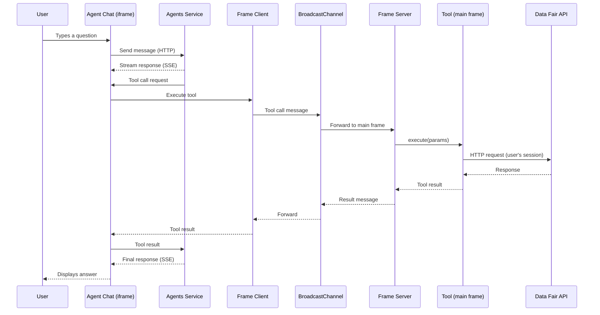
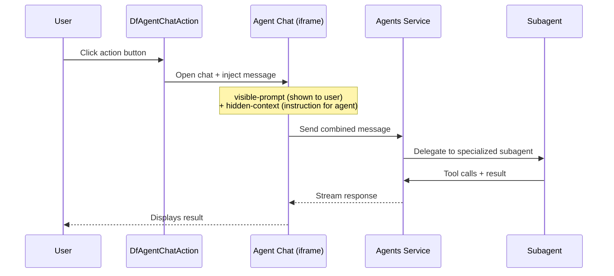

# AI Agent Integration Architecture

## 1. Overview

Data Fair integrates an external AI agents service (`data-fair/agents`) to provide a **back-office assistant** embedded directly in the platform UI. This assistant helps users navigate the interface, explore and query datasets, configure visualization applications, write calculated column expressions, and manage metadata.

The integration follows a **browser-side tool exposure** pattern: the main application frame registers tools and subagents using Vue composables, and the external agents service (running in an iframe) discovers and invokes them via a **WebMCP** protocol over BroadcastChannel.

### Key characteristics

- **Tools execute in the browser**: all tool logic runs client-side in the main application frame, with the user's session and permissions. The agent service never directly accesses the Data Fair API.
- **Bilingual**: all tool annotations, subagent prompts, and the system prompt support French and English.
- **Progressive activation**: the feature is gated behind an environment variable, an organization setting, and responsive UI rules.
- **Read-heavy, write-light**: of 22 tools, only 3 perform writes (navigate, set_expression, set_dataset_summary). All others are read-only.

### Activation flow

```
PRIVATE_AGENTS_URL (env var)
  -> config.privateAgentsUrl (API config)
    -> uiConfig.agentsIntegration (boolean flag exposed to frontend)
      -> GET /settings/{type}/{id}/agent-chat (per-account boolean)
        -> showAgentChat (reactive ref in UI)
          -> Tool registration + Chat drawer rendering
```

## 2. Architecture

### Component diagram


### Typical tool call sequence



### Action button flow



## 3. System Prompt

The main system prompt is defined in `ui/src/layouts/default-layout.vue` and injected into the chat drawer. It is selected based on the user's locale.

**French:**
> Tu es l'assistant IA de Data Fair, une plateforme de gestion et de publication de donnees privee ou ouvertes. Tu aides les utilisateurs a naviguer dans l'interface, explorer les jeux de donnees, interroger les donnees, configurer les applications de visualisation, et gerer les metadonnees.
>
> Consignes :
> - Reponds dans la langue de l'utilisateur
> - Sois concis et precis
> - Utilise frequemment l'outil getCurrentLocation pour comprendre le positionnement de l'utilisateur dans l'interface

**English:**
> You are the AI assistant for Data Fair, a platform for managing and publishing private or open data. You help users navigate the interface, explore datasets, query data, configure visualization applications, and manage metadata.
>
> Guidelines:
> - Respond in the user's language
> - Be concise and precise
> - Frequently use the tool getCurrentLocation to understand the positioning of the user in the UI.
> - When the data exploration subagent returns "Navigation params", use the navigate tool with those parameters as query to show the user the filtered data in the dataset table page (path: /dataset/{id}/table)

## 4. Tool Inventory

### 4.1 Navigation Tools

Source: `ui/src/composables/agent/navigation-tools.ts`

| Tool | Description | Parameters | Read-only |
|------|-------------|------------|-----------|
| `get_current_location` | Returns current page path, route name, params, query, and breadcrumbs | _(none)_ | Yes |
| `list_pages` | Lists all accessible pages organized by group (content, management, connectors, monitoring, help, admin, workflow, detail, d-frame) | _(none)_ | Yes |
| `navigate` | Navigates the application to a given path using Vue Router, optionally with query parameters for filters | `path` (string, required), `query` (object, optional) | **No** |

### 4.2 Dataset Metadata Tools

Source: `ui/src/composables/dataset/agent-tools.ts`

| Tool | Description | Parameters | Read-only |
|------|-------------|------------|-----------|
| `list_datasets` | Search and list datasets. Returns title, ID, status, row count, topics, keywords | `q` (search), `page`, `size` | Yes |
| `describe_dataset` | Full dataset metadata: title, description, schema, owner, visibility, topics, keywords, license, frequency, spatial/temporal info | `datasetId` (required) | Yes |

### 4.3 Dataset Data Query Tools

Source: `ui/src/composables/dataset/agent-data-tools.ts`

| Tool | Description | Key Parameters | Read-only |
|------|-------------|----------------|-----------|
| `get_dataset_schema` | Column schema table + 3 sample rows in CSV | `datasetId` | Yes |
| `search_data` | Full-text search and column filtering with pagination. Supports geo (`bbox`, `geoDistance`) and temporal (`dateMatch`) filters | `datasetId`, `q`, `filters`, `select`, `sort`, `size`, `page`, `bbox`, `geoDistance`, `dateMatch`, `next` | Yes |
| `aggregate_data` | Group by 1-3 columns with optional metric (sum, avg, min, max, count) | `datasetId`, `groupByColumns`, `metric`, `filters`, `sort`, `bbox`, `geoDistance`, `dateMatch` | Yes |
| `calculate_metric` | Single global metric: avg, sum, min, max, stats, value_count, cardinality, percentiles | `datasetId`, `fieldKey`, `metric`, `percents`, `filters`, `bbox`, `geoDistance`, `dateMatch` | Yes |
| `get_field_values` | Distinct values of a column | `datasetId`, `fieldKey`, `q`, `sort`, `size` | Yes |

**Filter syntax** (used in `filters` parameter): column key + suffix (`_eq`, `_neq`, `_search`, `_in`, `_nin`, `_starts`, `_contains`, `_gte`, `_gt`, `_lte`, `_lt`, `_exists`, `_nexists`). All values are strings.

### 4.4 Dataset Summary Tools

Source: `ui/src/composables/dataset/agent-summary-tools.ts`

Registered contextually when editing a dataset (via action button).

| Tool | Description | Parameters | Read-only |
|------|-------------|------------|-----------|
| `read_dataset_info` | Full metadata and schema of the dataset currently being edited | _(none)_ | Yes |
| `set_dataset_summary` | Sets the summary field on the dataset form | `summary` (string, required) | **No** |

### 4.5 Dataset Expression Tools

Source: `ui/src/composables/dataset/agent-expression-tools.ts`

Registered contextually when editing calculated columns (via action button).

| Tool | Description | Parameters | Read-only |
|------|-------------|------------|-----------|
| `get_expression_context` | Available columns as variables + target calculated column definition | `extensionIndex` (number, required) | Yes |
| `get_sample_data` | 5 sample rows in CSV for the available columns | `extensionIndex` (number, required) | Yes |
| `test_expression` | Validates syntax, compiles, and evaluates expression against sample data | `extensionIndex`, `expression` (required) | Yes |
| `set_expression` | Sets the expression on the calculated column | `extensionIndex`, `expression` (required) | **No** |

### 4.6 Dataset Changes Summary Tools

Source: `ui/src/composables/dataset/agent-changes-summary-tools.ts`

Registered contextually when editing dataset metadata (via action button).

| Tool | Description | Parameters | Read-only |
|------|-------------|------------|-----------|
| `read_dataset_changes` | Unified diff of metadata changes (original vs. edited) | _(none)_ | Yes |

### 4.7 Application Tools

Source: `ui/src/composables/application/agent-tools.ts`

| Tool | Description | Parameters | Read-only |
|------|-------------|------------|-----------|
| `list_applications` | Search and list applications. Returns title, ID, status, base app, topics | `q`, `page`, `size` | Yes |
| `describe_application` | Full application metadata including configured datasets | `applicationId` (required) | Yes |
| `list_base_applications` | List available base application templates (models) | `q`, `page`, `size` | Yes |

### 4.8 Geolocation Tools

Source: `ui/src/composables/agent/geo-tools.ts`

| Tool | Description | Parameters | Read-only |
|------|-------------|------------|-----------|
| `geocode_address` | Convert French addresses to coordinates via IGN Geoplateforme | `q` (required), `limit` | Yes |
| `get_user_geolocation` | Browser Geolocation API (requires user permission) | _(none)_ | Yes |

### 4.9 Connector Tools (conditional)

Source: `ui/src/composables/agent/connector-tools.ts`

These tools are only registered when the corresponding integration is enabled in `$uiConfig`.

**Processings** (if `processingsIntegration` is enabled):

| Tool | Description | Parameters | Read-only |
|------|-------------|------------|-----------|
| `list_processings` | List processings with search, status, scheduling info | `q`, `page`, `size` | Yes |
| `describe_processing` | Processing metadata: plugin, scheduling, owner | `processingId` (required) | Yes |

**Catalogs** (if `catalogsIntegration` is enabled):

| Tool | Description | Parameters | Read-only |
|------|-------------|------------|-----------|
| `list_catalogs` | List catalogs with search, type, URL | `q`, `page`, `size` | Yes |
| `describe_catalog` | Catalog metadata: type, URL, owner, description | `catalogId` (required) | Yes |

## 5. Subagent Inventory

Subagents are specialized agents with their own system prompt and a restricted set of tools. The main agent delegates to them for domain-specific tasks.

### 5.1 `dataset_data` - Data Analyst

- **Source**: `ui/src/composables/dataset/agent-data-tools.ts`
- **Model**: _(default)_
- **Tools**: `get_dataset_schema`, `search_data`, `aggregate_data`, `calculate_metric`, `get_field_values`

**System prompt:**
> You are a data analyst assistant for a data platform. You help users explore and understand datasets by querying their content.
>
> Workflow:
> 1. Always call get_dataset_schema first to understand column names, types, and sample data before using other tools.
> 2. Choose the right tool for the task:
>    - get_field_values: to discover distinct values of a column before filtering
>    - search_data: to retrieve specific rows matching filters or text search. Do NOT use for statistics.
>    - aggregate_data: to group rows by columns and count or compute per-group metrics
>    - calculate_metric: to compute a single global statistic
>
> Format:
> - Present results concisely with clear labels
> - For numeric results, round to 2 decimal places when appropriate
> - When returning tabular data, summarize key findings rather than just dumping raw rows
> - Respond in the same language as the user's question
> - When you perform a filtered query, include at the end of your response a "Navigation params" section listing the query parameters as key=value pairs. These use the same filter format and can be used by the main assistant to navigate the user to the dataset table page with the same filters applied.

### 5.2 `dataset_summarizer` - Summary Generator

- **Source**: `ui/src/composables/dataset/agent-summary-tools.ts`
- **Model**: `summarizer`
- **Tools**: `read_dataset_info`

**System prompt:**
> You are a dataset summarization expert for Data Fair, an open data publishing platform. Summaries are displayed in dataset catalogs to help users quickly understand what a dataset contains.
>
> Task:
> 1. Call read_dataset_info to get the full metadata and schema.
> 2. Write a summary describing the content and purpose of the dataset based on its title, description, columns, and other metadata.
> 3. Return the summary text as your final response.
>
> Format:
> - Between 200 and 300 characters long
> - Plain text only: no formatting, no markdown, no line breaks
> - Use an accessible tone -- the audience ranges from data analysts to general public users
> - Write in the same language as the dataset title and description

### 5.3 `dataset_changes_summarizer` - Changes Reviewer

- **Source**: `ui/src/composables/dataset/agent-changes-summary-tools.ts`
- **Model**: `summarizer`
- **Tools**: `read_dataset_changes`

**System prompt:**
> You are a metadata change reviewer for Data Fair, an open data publishing platform. You help users understand what they modified before saving.
>
> Task:
> 1. Call read_dataset_changes to get a unified diff of the metadata changes.
> 2. Produce a concise, human-readable summary of what changed.
>
> Focus on meaningful differences: title, description, schema changes (added/removed/renamed columns), license, topics, keywords. Ignore internal fields or trivial whitespace changes.
>
> Format:
> - Plain text, no markdown, no line breaks
> - Keep it under 500 characters
> - Write in the same language as the dataset content
> - If no meaningful changes are found, say so clearly

### 5.4 `expression_helper` - Expression Writer

- **Source**: `ui/src/composables/dataset/agent-expression-tools.ts`
- **Model**: _(default)_
- **Tools**: `get_expression_context`, `get_sample_data`, `test_expression`

**System prompt (summary):**
> You are an expression writing assistant for Data Fair. You help users write expr-eval expressions for calculated columns.
>
> Workflow:
> 1. Call get_expression_context to understand available columns and target type
> 2. Call get_sample_data to see real values
> 3. Write and test_expression to validate
> 4. Fix and retry on errors
> 5. Return the validated expression and test results as the final response
>
> (Includes full expression language reference: operators, string/math/date/special functions)

### 5.5 `appConfig_form` - Application Configuration Form Helper

- **Source**: Dynamically created by the `vjsf` component when `:sub-agent="true"` is set
- **Location**: `ui/src/components/application/application-config.vue`
- **Model**: _(managed by vjsf/lib-vuetify-agents)_
- **Tools**: _(form manipulation tools provided by vjsf)_

This subagent is automatically created by the VJSF (Vue JSON Schema Form) component to help users fill in the application configuration form through natural language. The main agent is instructed to delegate to it via the `configure-application` action's hidden context.

## 6. Action Buttons

Action buttons (`DfAgentChatAction`) are UI elements that open the chat drawer and inject a pre-configured message to trigger a specific workflow.

### 6.1 Summarize Dataset

- **Action ID**: `summarize-dataset`
- **Location**: `ui/src/components/dataset/dataset-info.vue` (next to summary textarea)
- **Visible prompt**: "Summarize this dataset" / "Resume ce jeu de donnees"
- **Hidden context**: `Use the dataset_summarizer subagent to produce a summary for this dataset. Once you receive the summary, present it to the user and ask for their approval before applying it. If approved, use the set_dataset_summary tool to set it. If the user wants changes, adjust accordingly.`
- **Condition**: `showAgentChat && can('writeDescription')`

### 6.2 Summarize Metadata Changes

- **Action ID**: `summarize-metadata-changes`
- **Location**: `ui/src/pages/dataset/[id]/edit-metadata.vue` (right navigation panel, visible when changes exist)
- **Visible prompt**: "Summarize changes" / "Resumer les modifications"
- **Hidden context**: `Use the dataset_changes_summarizer subagent to read and summarize the changes made to the dataset metadata.`
- **Condition**: `showAgentChat` and `hasDiff` (unsaved changes exist)
- **Style**: Tonal button with robot icon

### 6.3 Help Write Expression

- **Action ID**: `help-expression-{idx}` (one per calculated column)
- **Location**: `ui/src/components/dataset/dataset-extensions.vue` (next to each expression text field)
- **Visible prompt**: "Help me write this expression" / "Aide-moi a ecrire cette expression"
- **Hidden context**: `The user wants help writing an expr-eval expression for calculated column "{name}" (type: {type}, extension index: {idx}). {current expression if any}. Start by asking the user what they want to compute or achieve with this column. Do NOT call the expression_helper subagent until you understand the user's intent. Once you receive the expression from the subagent, present it and the test results to the user. If approved, use the set_expression tool to apply it. If the user wants changes, adjust accordingly.`
- **Condition**: `showAgentChat && can('writeDescriptionBreaking')`

### 6.4 Help Filter Table Data

- **Action ID**: `help-filter-table`
- **Location**: `ui/src/components/dataset/table/dataset-table.vue` (in the table toolbar)
- **Visible prompt**: "Help me filter this data" / "Aide-moi a filtrer ces donnees"
- **Hidden context**: Describes the current dataset (title, ID) and any active filters. Instructs the agent to ask the user what they want to see or filter before using the data exploration subagent. After exploring, the main agent uses the `navigate` tool with query parameters to apply filters to the table page.
- **Condition**: `showAgentChat`

**Workflow**: This action demonstrates the **subagent-to-navigation handoff** pattern. The `dataset_data` subagent explores data and returns "Navigation params" in its response. The main agent then passes those params as the `query` argument to the `navigate` tool, which updates the table page URL. Since query params are reactively bound to the table's filter composable, the table filters update live.

### 6.5 Configure Application

- **Action ID**: `configure-application`
- **Location**: `ui/src/components/application/application-config.vue` (above the configuration form)
- **Visible prompt**: "Help me configure this application" / "Aidez-moi a configurer cette application"
- **Hidden context**: `Use the subagent tool appConfig_form to help the user configure the current application. Start the session by asking the user what they want to achieve. The base application type is "{title}". Description: {description}. Category: {category}. The application title is "{appTitle}".`
- **Condition**: `showAgentChat && canWriteConfig`

## 7. Tool Registration Lifecycle

Tools are registered in the main application layout (`default-layout.vue`) using a Vue `effectScope`:

```
watchEffect:
  if showAgentChat && no scope:
    create effectScope
    register:
      - useAgentNavigationTools (3 tools)
      - useAgentDatasetTools (2 tools)
      - useAgentDatasetDataTools (5 tools + 1 subagent)
      - useAgentGeoTools (2 tools)
      - useAgentApplicationTools (3 tools)
      - useAgentConnectorTools (0-4 tools, conditional)

  if !showAgentChat && scope exists:
    stop scope (unregisters all tools)
```

The summary, expression, and changes tools are registered separately in their respective page components, scoped to the editing context.

## 8. Key Files Reference

| File | Role |
|------|------|
| `ui/src/main.ts` | Initializes `useFrameServer('data-fair')` — WebMCP BroadcastChannel server |
| `ui/src/layouts/default-layout.vue` | System prompt, tool registration lifecycle, chat drawer rendering |
| `ui/src/composables/agent/use-show-chat.ts` | Feature flag: provides `showAgentChat` reactive ref |
| `ui/src/composables/agent/navigation-tools.ts` | Navigation tools (3) |
| `ui/src/composables/agent/geo-tools.ts` | Geolocation tools (2) |
| `ui/src/composables/agent/connector-tools.ts` | Processings & catalogs tools (0-4) |
| `ui/src/composables/agent/utils.ts` | `createAgentTranslator`, `agentToolError` helpers |
| `ui/src/composables/dataset/agent-tools.ts` | Dataset metadata tools (2) + `serializeDatasetInfo` |
| `ui/src/composables/dataset/agent-data-tools.ts` | Dataset data query tools (5) + `dataset_data` subagent |
| `ui/src/composables/dataset/agent-summary-tools.ts` | Summary tools (2) + `dataset_summarizer` subagent |
| `ui/src/composables/dataset/agent-changes-summary-tools.ts` | Changes tools (1) + `dataset_changes_summarizer` subagent |
| `ui/src/composables/dataset/agent-expression-tools.ts` | Expression tools (4) + `expression_helper` subagent |
| `ui/src/composables/application/agent-tools.ts` | Application tools (3) |
| `ui/src/components/dataset/dataset-info.vue` | `summarize-dataset` action button |
| `ui/src/pages/dataset/[id]/edit-metadata.vue` | `summarize-metadata-changes` action button |
| `ui/src/components/dataset/dataset-extensions.vue` | `help-expression-{idx}` action buttons |
| `ui/src/components/dataset/table/dataset-table.vue` | `help-filter-table` action button |
| `ui/src/components/application/application-config.vue` | `configure-application` action button + VJSF sub-agent |
| `ui/src/components/layout/layout-navigation-top.vue` | `DfAgentChatToggle` button in top navigation |
| `api/src/ui-config.ts` | Exports `agentsIntegration` flag |
| `api/src/settings/router.ts` | `GET /settings/:type/:id/agent-chat` endpoint |
| `api/types/settings/schema.js` | `agentChat` boolean setting definition |

## 9. Dependencies

| Package | Role |
|---------|------|
| `@data-fair/lib-vue-agents` | Vue composables: `useAgentTool`, `useAgentSubAgent`, `useFrameServer` |
| `@data-fair/lib-vuetify-agents` | Vue components: `DfAgentChatDrawer`, `DfAgentChatToggle`, `DfAgentChatAction` |
