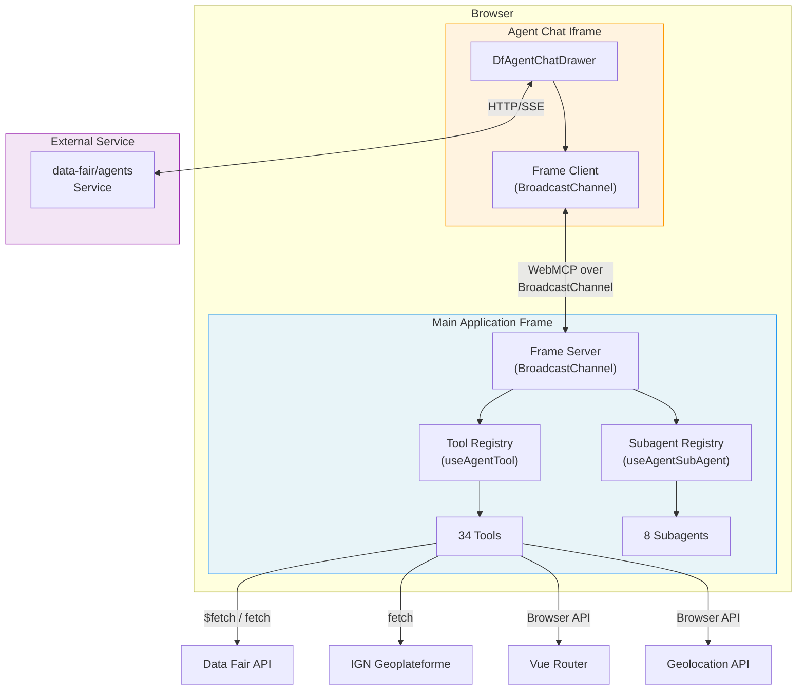
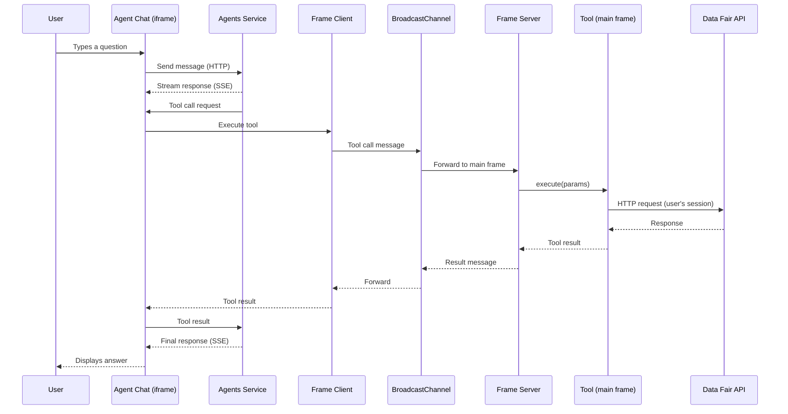
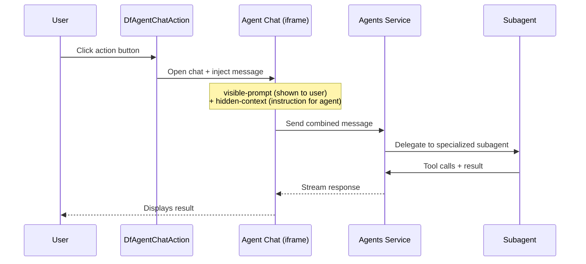

# AI Agent Integration Architecture

## 1. Overview

Data Fair integrates an external AI agents service (`data-fair/agents`) to provide a **back-office assistant** embedded directly in the platform UI. This assistant helps users navigate the interface, explore and query datasets, configure visualization applications, write calculated column expressions, and manage metadata.

The integration follows a **browser-side tool exposure** pattern: the main application frame registers tools and subagents using Vue composables, and the external agents service (running in an iframe) discovers and invokes them via a **WebMCP** protocol over BroadcastChannel.

### Key characteristics

- **Tools execute in the browser**: all tool logic runs client-side in the main application frame, with the user's session and permissions. The agent service never directly accesses the Data Fair API.
- **Bilingual**: all tool annotations, subagent prompts, and the system prompt support French and English.
- **Progressive activation**: the feature is gated behind an environment variable, an organization setting, and responsive UI rules.
- **Read-heavy, write-light**: of 34 tools, only 7 perform writes (navigate, set_expression, set_dataset_summary, set_dataset_description, set_property_config, open_add_line_dialog, open_edit_line_dialog). The creation wizard tools manipulate client-side form state only — no server-side writes.

### Activation flow

```
PRIVATE_AGENTS_URL (env var)
  -> config.privateAgentsUrl (API config)
    -> uiConfig.agentsIntegration (boolean flag exposed to frontend)
      -> GET /settings/{type}/{id}/agent-chat (per-account boolean)
        -> showAgentChat (reactive ref in UI)
          -> Tool registration + Chat drawer rendering
```

## 2. Architecture

### Component diagram



### Typical tool call sequence



### Action button flow



## 3. System Prompt

Defined in `ui/src/layouts/default-layout.vue`, locale-dependent. Instructs the agent to be a Data Fair assistant: help navigate, explore datasets, query data, configure applications, manage metadata. Key directives: respond in the user's language, be concise, frequently use `getCurrentLocation`, and use `navigate` to show filtered data after subagent exploration.

## 4. Workflows

### 4.1 Free Chat

The user types directly in the chat drawer. The agent has access to all globally-registered tools (navigation, dataset listing/description, data queries, applications, geolocation, connectors) and can combine them freely.

### 4.2 Explore Dataset Data

| | |
|---|---|
| **Trigger** | Free chat or via filter/quality actions |
| **Subagent** | `dataset_data` — data analyst that queries dataset content |
| **Pattern** | Schema-first exploration: always reads schema before querying. Returns "Navigation params" for table filtering handoff. |
| **Tools** | `get_dataset_schema`, `search_data`, `aggregate_data`, `calculate_metric`, `get_field_values` |
| **Source** | `ui/src/composables/dataset/agent-data-tools.ts` |

### 4.3 Filter Table Data

| | |
|---|---|
| **Trigger** | Action button on dataset table toolbar |
| **Action ID** | `help-filter-table` |
| **Pattern** | **Subagent-to-navigation handoff**: asks user intent, delegates to `dataset_data` subagent, then uses `navigate` with query params to apply filters to the table page. Query params are reactively bound to the table's filter composable. |
| **Source** | `ui/src/components/dataset/table/dataset-table.vue` |

### 4.4 Check Data Quality

| | |
|---|---|
| **Trigger** | Action button on dataset table toolbar |
| **Action ID** | `check-data-quality` |
| **Subagent** | `data_quality_checker` — systematic 6-step audit (completeness, uniqueness, outliers, format consistency, distribution anomalies) |
| **Pattern** | Asks user for full analysis or specific focus, then delegates. Produces a structured report with quality score. |
| **Tools** | Reuses data query tools: `get_dataset_schema`, `search_data`, `aggregate_data`, `calculate_metric`, `get_field_values` |
| **Source** | `ui/src/composables/dataset/agent-data-quality-tools.ts` |

### 4.5 Summarize Dataset

| | |
|---|---|
| **Trigger** | Action button next to summary textarea |
| **Action ID** | `summarize-dataset` |
| **Subagent** | `dataset_summarizer` (model: `summarizer`) — reads metadata, produces 200-300 char plain text summary |
| **Pattern** | Generate, present to user, apply on approval via `set_dataset_summary` |
| **Tools** | `read_dataset_info`, `set_dataset_summary` |
| **Source** | `ui/src/composables/dataset/agent-summary-tools.ts` |

### 4.6 Write Dataset Description

| | |
|---|---|
| **Trigger** | Action button next to description markdown editor |
| **Action ID** | `describe-dataset` |
| **Subagent** | `dataset_description_writer` — reads metadata, produces 500-2000 char markdown description |
| **Pattern** | Asks user what to emphasize, generates, presents, applies on approval via `set_dataset_description` |
| **Tools** | `read_dataset_info`, `set_dataset_description` |
| **Source** | `ui/src/composables/dataset/agent-description-tools.ts` |

### 4.7 Summarize Metadata Changes

| | |
|---|---|
| **Trigger** | Action button on edit-metadata page (visible when unsaved changes exist) |
| **Action ID** | `summarize-metadata-changes` |
| **Subagent** | `dataset_changes_summarizer` (model: `summarizer`) — reads unified diff, produces <500 char plain text summary |
| **Pattern** | Direct delegation, no user confirmation needed (read-only output) |
| **Tools** | `read_dataset_changes` |
| **Source** | `ui/src/composables/dataset/agent-changes-summary-tools.ts` |

### 4.8 Write Calculated Expression

| | |
|---|---|
| **Trigger** | Action button next to each expression text field |
| **Action ID** | `help-expression-{idx}` (one per calculated column) |
| **Subagent** | `expression_helper` — writes and tests expr-eval expressions (has full language reference in prompt) |
| **Pattern** | Asks user intent first, then: get context → get sample data → write & test expression → fix on errors → present with test results → apply on approval via `set_expression` |
| **Tools** | `get_expression_context`, `get_sample_data`, `test_expression`, `set_expression` |
| **Source** | `ui/src/composables/dataset/agent-expression-tools.ts` |

### 4.9 Annotate Schema

| | |
|---|---|
| **Trigger** | Action button on schema toolbar |
| **Action ID** | `help-annotate-schema` |
| **Subagent** | `schema_annotator` — suggests human-readable titles and descriptions for columns |
| **Source** | `ui/src/composables/dataset/agent-schema-annotation-tools.ts` |

### 4.10 Optimize Property Config

| | |
|---|---|
| **Trigger** | Action button on schema toolbar |
| **Action ID** | `help-configure-properties` |
| **Subagent** | `property_config_advisor` (model: `summarizer`) — suggests type overrides and capability optimizations |
| **Pattern** | Asks user what they need (type corrections, capability optimization, or both). Reads config and sample data, suggests changes with explanations, applies via `set_property_config`. Does NOT write expressions — directs to expression_helper. |
| **Tools** | `read_property_config`, `set_property_config` |
| **Source** | `ui/src/composables/dataset/agent-property-config-tools.ts` |

### 4.11 Configure Application

| | |
|---|---|
| **Trigger** | Action button above application configuration form |
| **Action ID** | `configure-application` |
| **Subagent** | `appConfig_form` — VJSF-managed form manipulation subagent |
| **Pattern** | **VJSF webmcp**: the VJSF component creates the subagent automatically when `:sub-agent="true"`. Agent asks what the user wants, then delegates to the form subagent. |
| **Source** | `ui/src/components/application/application-config.vue` |

### 4.12 Enter Data (REST Dataset)

| | |
|---|---|
| **Trigger** | Action button on edit-data page |
| **Action ID** | `help-edit-data` |
| **Subagent** | `editLine_form` — VJSF-managed form subagent for add/edit line dialogs |
| **Pattern** | **Dialog-opening + VJSF webmcp**: agent opens dialog via `open_add_line_dialog` or `open_edit_line_dialog`, then delegates form filling to VJSF subagent. User retains Save button control. |
| **Tools** | `open_add_line_dialog`, `open_edit_line_dialog` |
| **Source** | `ui/src/components/dataset/table/dataset-table.vue`, `ui/src/components/dataset/form/dataset-edit-line-form.vue` |

### 4.13 Create Application

| | |
|---|---|
| **Trigger** | Action button in application creation stepper |
| **Action ID** | `help-create-application` |
| **Pattern** | **Stepper-driving**: agent asks user what visualization they want, uses `list_base_applications`/`list_applications` for discovery, then drives the wizard with creation tools. User retains final Save. |
| **Tools** | `select_creation_type`, `select_base_application`, `select_copy_application`, `set_application_title` |
| **Source** | `ui/src/composables/application/agent-creation-tools.ts`, `ui/src/pages/new-application.vue` |

### 4.14 Create Dataset

| | |
|---|---|
| **Trigger** | Action button in dataset creation stepper |
| **Action ID** | `help-create-dataset` |
| **Pattern** | **Stepper-driving**: agent asks about data source, recommends dataset type (file, rest, virtual, metaOnly), drives wizard. File upload remains manual. User retains final Create/Import. |
| **Tools** | `select_dataset_type`, `set_dataset_title`, `set_rest_options`, `skip_init_from_step`, `advance_to_confirmation` |
| **Source** | `ui/src/composables/dataset/agent-creation-tools.ts`, `ui/src/pages/new-dataset.vue` |

## 5. Tool Reference

| Tool | Category | R/W | Source |
|------|----------|-----|--------|
| `get_current_location` | Navigation | R | `agent/navigation-tools.ts` |
| `list_pages` | Navigation | R | `agent/navigation-tools.ts` |
| `navigate` | Navigation | **W** | `agent/navigation-tools.ts` |
| `list_datasets` | Dataset metadata | R | `dataset/agent-tools.ts` |
| `describe_dataset` | Dataset metadata | R | `dataset/agent-tools.ts` |
| `get_dataset_schema` | Dataset data | R | `dataset/agent-data-tools.ts` |
| `search_data` | Dataset data | R | `dataset/agent-data-tools.ts` |
| `aggregate_data` | Dataset data | R | `dataset/agent-data-tools.ts` |
| `calculate_metric` | Dataset data | R | `dataset/agent-data-tools.ts` |
| `get_field_values` | Dataset data | R | `dataset/agent-data-tools.ts` |
| `read_dataset_info` | Dataset summary | R | `dataset/agent-summary-tools.ts` |
| `set_dataset_summary` | Dataset summary | **W** | `dataset/agent-summary-tools.ts` |
| `set_dataset_description` | Dataset description | **W** | `dataset/agent-description-tools.ts` |
| `read_dataset_changes` | Dataset changes | R | `dataset/agent-changes-summary-tools.ts` |
| `get_expression_context` | Expressions | R | `dataset/agent-expression-tools.ts` |
| `get_sample_data` | Expressions | R | `dataset/agent-expression-tools.ts` |
| `test_expression` | Expressions | R | `dataset/agent-expression-tools.ts` |
| `set_expression` | Expressions | **W** | `dataset/agent-expression-tools.ts` |
| `read_property_config` | Property config | R | `dataset/agent-property-config-tools.ts` |
| `set_property_config` | Property config | **W** | `dataset/agent-property-config-tools.ts` |
| `open_add_line_dialog` | REST data entry | **W** | `dataset/table/dataset-table.vue` |
| `open_edit_line_dialog` | REST data entry | **W** | `dataset/table/dataset-table.vue` |
| `geocode_address` | Geolocation | R | `agent/geo-tools.ts` |
| `get_user_geolocation` | Geolocation | R | `agent/geo-tools.ts` |
| `list_applications` | Applications | R | `application/agent-tools.ts` |
| `describe_application` | Applications | R | `application/agent-tools.ts` |
| `list_base_applications` | Applications | R | `application/agent-tools.ts` |
| `select_creation_type` | App creation | W* | `application/agent-creation-tools.ts` |
| `select_base_application` | App creation | W* | `application/agent-creation-tools.ts` |
| `select_copy_application` | App creation | W* | `application/agent-creation-tools.ts` |
| `set_application_title` | App creation | W* | `application/agent-creation-tools.ts` |
| `select_dataset_type` | Dataset creation | W* | `dataset/agent-creation-tools.ts` |
| `set_dataset_title` | Dataset creation | W* | `dataset/agent-creation-tools.ts` |
| `set_rest_options` | Dataset creation | W* | `dataset/agent-creation-tools.ts` |
| `skip_init_from_step` | Dataset creation | W* | `dataset/agent-creation-tools.ts` |
| `advance_to_confirmation` | Dataset creation | W* | `dataset/agent-creation-tools.ts` |
| `list_processings` | Connectors | R | `agent/connector-tools.ts` |
| `describe_processing` | Connectors | R | `agent/connector-tools.ts` |
| `list_catalogs` | Connectors | R | `agent/connector-tools.ts` |
| `describe_catalog` | Connectors | R | `agent/connector-tools.ts` |

All source paths are relative to `ui/src/composables/` unless otherwise noted. **W*** = client-side state only (no server write). Connector tools are conditional on integration flags.

## 6. Subagent Reference

| Subagent | Model | Purpose | Tools |
|----------|-------|---------|-------|
| `dataset_data` | default | Data exploration and querying | `get_dataset_schema`, `search_data`, `aggregate_data`, `calculate_metric`, `get_field_values` |
| `data_quality_checker` | default | Systematic data quality audit (6-step) | Same as `dataset_data` |
| `dataset_summarizer` | summarizer | Generate 200-300 char dataset summaries | `read_dataset_info` |
| `dataset_description_writer` | default | Generate 500-2000 char markdown descriptions | `read_dataset_info` |
| `dataset_changes_summarizer` | summarizer | Summarize metadata diff (<500 chars) | `read_dataset_changes` |
| `expression_helper` | default | Write and test expr-eval expressions | `get_expression_context`, `get_sample_data`, `test_expression` |
| `schema_annotator` | summarizer | Suggest column titles and descriptions | Schema annotation tools |
| `property_config_advisor` | summarizer | Suggest type overrides and capability optimizations | `read_property_config`, `set_property_config` |
| `appConfig_form` | VJSF-managed | Fill application configuration form via natural language | VJSF form tools |
| `editLine_form` | VJSF-managed | Fill add/edit line form via natural language | VJSF form tools |

## 7. Key Files Reference

| File | Role |
|------|------|
| `ui/src/main.ts` | Initializes `useFrameServer('data-fair')` — WebMCP BroadcastChannel server |
| `ui/src/layouts/default-layout.vue` | System prompt, tool registration lifecycle, chat drawer rendering |
| `ui/src/composables/agent/use-show-chat.ts` | Feature flag: provides `showAgentChat` reactive ref |
| `ui/src/composables/agent/navigation-tools.ts` | Navigation tools (3) |
| `ui/src/composables/agent/geo-tools.ts` | Geolocation tools (2) |
| `ui/src/composables/agent/connector-tools.ts` | Processings & catalogs tools (0-4) |
| `ui/src/composables/agent/utils.ts` | Shared helpers: `createAgentTranslator`, `agentToolError`, `csvEscape`, `toCsv`, `cleanRow`, `fetchSampleRows`, `buildPaginatedQuery` |
| `ui/src/composables/dataset/agent-tools.ts` | Dataset metadata tools (2) + `serializeDatasetInfo` |
| `ui/src/composables/dataset/agent-data-tools.ts` | Dataset data query tools (5) + `dataset_data` subagent |
| `ui/src/composables/dataset/agent-data-quality-tools.ts` | `data_quality_checker` subagent (reuses data query tools) |
| `ui/src/composables/dataset/agent-summary-tools.ts` | Summary tools (2) + `dataset_summarizer` subagent |
| `ui/src/composables/dataset/agent-description-tools.ts` | Description tools (2) + `dataset_description_writer` subagent |
| `ui/src/composables/dataset/agent-changes-summary-tools.ts` | Changes tools (1) + `dataset_changes_summarizer` subagent |
| `ui/src/composables/dataset/agent-expression-tools.ts` | Expression tools (4) + `expression_helper` subagent |
| `ui/src/composables/dataset/agent-schema-annotation-tools.ts` | Schema annotation tools (2) + `schema_annotator` subagent |
| `ui/src/composables/dataset/agent-property-config-tools.ts` | Property config tools (2) + `property_config_advisor` subagent |
| `ui/src/composables/application/agent-tools.ts` | Application tools (3) |
| `ui/src/composables/application/agent-creation-tools.ts` | Application creation wizard tools (4) |
| `ui/src/composables/dataset/agent-creation-tools.ts` | Dataset creation wizard tools (5) |
| `ui/src/components/dataset/dataset-info.vue` | `summarize-dataset` and `describe-dataset` action buttons |
| `ui/src/pages/dataset/[id]/edit-metadata.vue` | `summarize-metadata-changes` action button |
| `ui/src/components/dataset/dataset-extensions.vue` | `help-expression-{idx}` action buttons |
| `ui/src/components/dataset/dataset-schema.vue` | `help-annotate-schema` and `help-configure-properties` action buttons |
| `ui/src/components/dataset/table/dataset-table.vue` | `help-filter-table` and `check-data-quality` action buttons, line edit tools |
| `ui/src/components/dataset/form/dataset-edit-line-form.vue` | VJSF webmcp form for line add/edit (`editLine_form` sub-agent) |
| `ui/src/pages/dataset/[id]/edit-data.vue` | `help-edit-data` action button |
| `ui/src/components/application/application-config.vue` | `configure-application` action button + VJSF sub-agent |
| `ui/src/pages/new-application.vue` | `help-create-application` action button + creation tools registration |
| `ui/src/pages/new-dataset.vue` | `help-create-dataset` action button + creation tools registration |
| `ui/src/components/layout/layout-navigation-top.vue` | `DfAgentChatToggle` button in top navigation |
| `api/src/ui-config.ts` | Exports `agentsIntegration` flag |
| `api/src/settings/router.ts` | `GET /settings/:type/:id/agent-chat` endpoint |
| `api/types/settings/schema.js` | `agentChat` boolean setting definition |

## 8. Dependencies

| Package | Role |
|---------|------|
| `@data-fair/lib-vue-agents` | Vue composables: `useAgentTool`, `useAgentSubAgent`, `useFrameServer` |
| `@data-fair/lib-vuetify-agents` | Vue components: `DfAgentChatDrawer`, `DfAgentChatToggle`, `DfAgentChatAction` |
