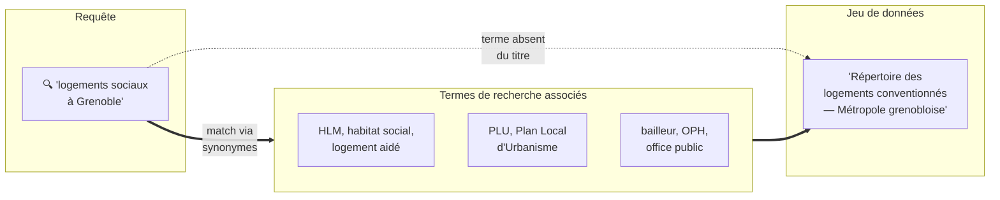
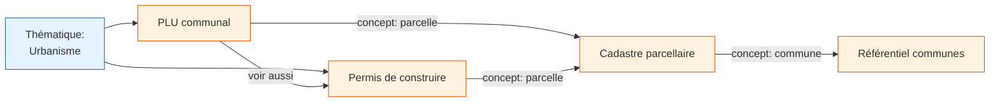
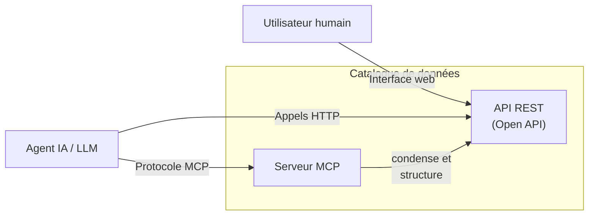
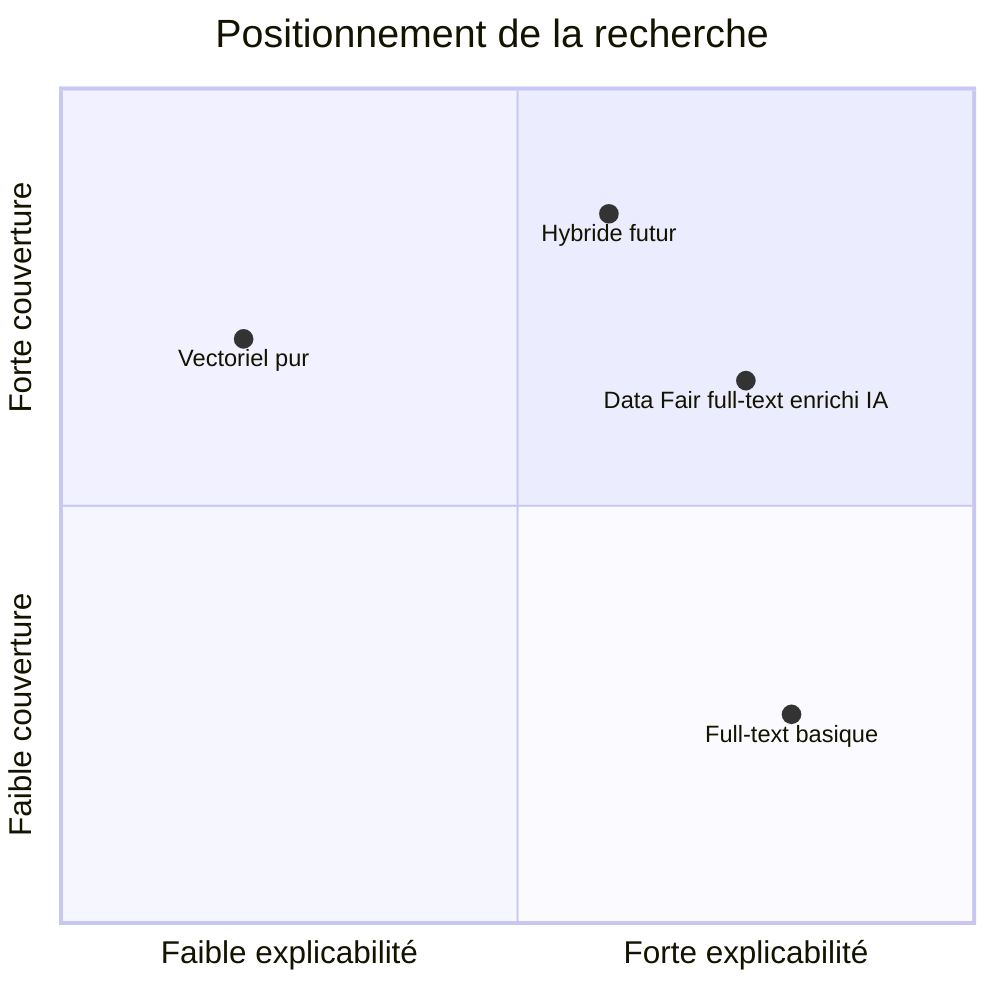

> Mis à jour le 2026-09-21 — décrit ce qui est implémenté dans data-fair ; les perspectives sont dans la dernière section.

## Contexte

Les portails de données de la plateforme Data Fair ont pour mission première d'exposer un catalogue de données facile à explorer et à exploiter. Si les utilisateurs humains restent la cible prioritaire, la plateforme est désormais conçue pour être nativement "LLM-ready".

L'objectif est que les agents d'IA (utilisant nos catalogues comme sources de connaissances pour le RAG - Retrieval-Augmented Generation) puissent identifier le bon jeu de données avec la même précision qu'un expert métier.

> **Périmètre :** ce document traite uniquement de la **découverte** des jeux de données dans le catalogue (recherche, navigation, sélection). L'exploitation des données elles-mêmes (requêtes, téléchargements, visualisations) n'est pas abordée ici.

## Une recherche textuelle adaptée au français

Le catalogue n'est pas indexé par l'index texte `$text` de MongoDB, mais par un index de termes inversé que data-fair construit et maintient lui-même (`api/src/misc/utils/text-search/`, détail dans [catalog-search.md](catalog-search.md)). Chaque jeu de données porte la liste de ses termes, leurs positions par champ et la longueur de chaque champ ; le score est calculé au moment de la requête, dans l'agrégation MongoDB. Les champs indexés et leurs poids :

| champ | poids |
|---|---|
| `title` | ×3 |
| `searchTerms` (termes de recherche associés, voir ci-dessous) | ×3 |
| `summary` | ×2 |
| `description` | ×1 |
| `keywords` | ×1 |
| `topics.title` | ×1 |
| `owner.name`, `owner.departmentName` | ×1 |
| `_searchText` (vocabulaire du schéma calculé, voir ci-dessous) | ×1 |

Les applications sont indexées de la même façon, sur un ensemble de champs plus restreint (titre, résumé, description, nom du propriétaire), avec les mêmes poids.

L'analyse linguistique est le français — désaccentuation, passage en minuscules, racinisation légère et retrait des mots vides. La recherche n'a pas de réglage de langue propre : elle suit `config.i18n.defaultLocale` (`api/config/default.cjs`), par défaut `'fr'`, le code ISO 639-1 que l'analyseur attend et que le reste de l'API utilise déjà comme langue du déploiement. La racinisation est volontairement *légère* : elle retire les marques de nombre et de genre mais laisse la dérivation intacte, de sorte que "consommation" ne soit pas ramené à "consomm".

Le score combine trois facteurs, là où un moteur `$text` n'en utilise que deux :

- **la fréquence du terme dans le champ**, normalisée par la longueur du champ (BM25) — une occurrence dans un titre court compte plus que la même occurrence noyée dans une longue description ;
- **la rareté du terme dans le catalogue** (IDF) — un mot présent dans soixante titres pèse peu, un mot qui ne figure que dans deux jeux de données pèse beaucoup. C'est ce facteur qui manquait à `$text` et qui laissait un mot générique du titre l'emporter sur la correspondance réellement discriminante ;
- **le poids du champ**, combiné en *dis_max* : c'est le meilleur champ qui l'emporte, les autres ne contribuant qu'à hauteur de 30 %. Additionner les champs récompenserait un document qui touche un terme dans beaucoup de champs à la fois, et les longues descriptions noieraient un titre précis.

La sélection des candidats se fait sur les termes les plus rares de la requête (les trois plus rares par défaut, jamais moins de deux), ce qui rend la recherche insensible à un mot inconnu isolé : une faute de frappe est écartée du plan de requête au lieu de vider la page de résultats. Les expressions entre guillemets sont vérifiées sur les positions réellement enregistrées, et un terme préfixé de `-` exclut.

La limite qui demeure est d'ordre lexical, non plus statistique : la recherche ne trouve que des mots effectivement présents dans le contenu indexé. Un usager qui tape "gymnase" ne trouvera pas un jeu de données intitulé "Équipements sportifs" si ce mot ne figure nulle part — c'est précisément ce que viennent combler les deux mécanismes décrits ci-dessous.

## Les termes de recherche associés

`searchTerms` est un champ de texte libre par jeu de données (1000 caractères maximum), destiné aux synonymes, sigles avec leur développement (ex. "PLU" → "Plan Local d'Urbanisme") et formulations courantes qui ne figurent pas forcément dans le titre officiel. Il est déclaré dans `api/types/dataset/schema.js`, modifiable dans le formulaire de métadonnées du back-office (`ui/src/components/dataset/metadata/dataset-metadata-form.vue`), et activable par organisation via `settings.datasetsMetadata.searchTerms.active` (par défaut activé).

Ce champ n'est jamais affiché aux visiteurs des portails et n'est pas une facette : c'est précisément pour cela qu'il n'est pas simplement ajouté à `keywords`, qui sert de facette et, sur les catalogues réels, de liste de tags thématiques — y verser des dizaines de synonymes la rendrait inutilisable. Il est indexé au même poids que le titre (×3) : un terme de recherche est choisi précisément parce que c'est le mot qu'un usager tapera, il a donc la même valeur discriminante que le titre officiel et non celle d'une longue description. Combiné en *dis_max*, ce poids fait qu'une correspondance sur un synonyme se défend face à une correspondance sur le titre d'un autre jeu de données.

« Jamais affiché » ne veut pas dire privé : le champ est renvoyé par l'API à quiconque a la permission `readDescription`, y compris un visiteur anonyme d'un jeu de données public — il n'est simplement affiché dans aucune interface. N'y mettez donc pas de jargon interne ou d'information confidentielle.

Il peut être renseigné à la main ou proposé par l'assistant : un bouton d'action `suggest-search-terms` dans le formulaire de métadonnées déclenche le sous-agent `search_terms_writer` (`ui/src/composables/dataset/agent-summary-tools.ts`), qui lit titre, résumé, description, mots-clés, thématiques et schéma pour proposer une liste de termes. Rien n'est enregistré automatiquement : le sous-agent propose, l'utilisateur approuve, et l'outil `set_dataset_metadata` (`ui/src/composables/dataset/agent-metadata-tools-logic.ts`) remplit le champ du formulaire — c'est l'utilisateur qui clique sur Enregistrer.

## Le vocabulaire du schéma dans la recherche

`_searchText` est un champ calculé, jamais saisi à la main, produit par la fonction pure `computeSearchText` (`api/src/datasets/operations.ts`). Il rassemble les titres des colonnes du schéma (tronqués à 200 caractères) et le début de leur description : les 200 premiers caractères, coupés sur un espace ; si aucun espace ne figure dans ces 200 premiers caractères — un jeton unique comme une URL —, la coupe cherche l'espace suivant jusqu'à 400 caractères, au-delà desquels elle retombe sur une troncature brute à 200.

Le champ est borné à 8 Kio ; au-delà de la limite, des colonnes entières sont écartées plutôt que des chaînes tronquées. Les clés de colonnes ne sont volontairement pas indexées : mesuré sur trois catalogues réels, elles n'apportaient aucun gain par rapport aux titres, qui en sont déjà des variantes (`benchmark/catalog-search/FINDINGS.md`, §4). Les **valeurs** des colonnes ne le sont pas non plus : le même banc d'essai les montre gagnantes en rappel sur les catalogues catégoriels mais bruyantes sur les catalogues à codes, et elles exposent de la donnée et non des métadonnées (§4, point 4). Le levier resté ouvert pour un jeu de données qui en aurait besoin est le champ `searchTerms`, saisi par le producteur, décrit plus haut — un réglage par jeu de données plutôt qu'un commutateur d'organisation.

Une garde de permissions automatique, interne à `computeSearchText`, protège ce contenu : si un ayant droit peut `list` le jeu de données sans avoir `readSchema`, `_searchText` est entièrement retiré, car une correspondance de recherche révélerait qu'une colonne existe à quiconque peut lister le jeu de données sans avoir accès à son schéma. `_searchText` est recalculé à la création du jeu de données, à chaque patch touchant le schéma (ce qui couvre la finalisation) et à chaque écriture de permissions (`api/src/datasets/service.ts`, `api/src/misc/utils/permissions.ts`). Les jeux de données existants ont été rétro-remplis par `api/upgrade/6.20.0/01-backfill-search-text.ts`, puis indexés par `02-backfill-search-index.ts`. Le champ est systématiquement retiré des réponses de l'API (`api/src/datasets/utils/index.ts`, `api/src/datasets/routes/write.ts`) : il n'existe que pour l'indexation.

## Aperçu en liste compacte

Chaque jeu de données dispose d'un titre et d'un résumé dense. Ce format permet un scan rapide du catalogue, tant pour l'œil humain que pour la fenêtre de contexte d'un LLM, facilitant la sélection du jeu de données le plus pertinent parmi une liste de résultats.

## Un aperçu des données dès les métadonnées

La plateforme permet d'inclure dans les métadonnées un aperçu des valeurs distinctes de colonnes clés. Pour un agent IA, c'est un outil de "fact-checking" immédiat : il peut confirmer la présence d'une information spécifique (ex: une ville, un code nomenclature) avant même d'interroger la donnée brute.

Cet aperçu a des limites qu'un agent doit connaître : il est calculé automatiquement, uniquement pour les colonnes ayant au plus 50 valeurs distinctes, et il est absent pour les colonnes trop clairsemées ou à trop forte cardinalité. L'absence d'une valeur dans cet aperçu ne prouve donc rien sur sa présence dans les données — un agent ne doit pas la lire comme une preuve d'absence.

## Un "graphe" de connaissances pour naviguer le catalogue

Chaque jeu de données est lié à d'autres via :

- Des choix éditoriaux ("voir aussi").
- Des thématiques.
- Des concepts associés aux colonnes.

Ces liens permettent aux agents IA de naviguer de manière récursive dans le catalogue, passant d'un concept général à un jeu de données spécifique par rebonds logiques. Cette navigation n'est aujourd'hui exposée aux agents qu'en partie (voir ci-dessous) ; l'exposition complète (facettes et filtres sur `list_datasets`, `relatedDatasets` dans `describe_dataset`) est l'objet d'une spécification séparée (spec B).

## Deux interfaces

L'exploration du catalogue est exposée via deux interfaces complémentaires : l'API REST du portail et un serveur MCP.

### Interface humaine : le portail web

L'interface web s'appuie sur une API REST documentée via Open API. Cette documentation exhaustive constitue le contrat de référence de la plateforme et peut être consommée directement par tout client HTTP, y compris des agents IA. Elle bénéficie pleinement de la recherche textuelle décrite ci-dessus.

### Interface machine : le serveur MCP

Le serveur [MCP](https://modelcontextprotocol.io/) (Model Context Protocol) n'est pas contenu dans ce dépôt : c'est un projet séparé, `@data-fair/mcp`, déployé sur les portails qui l'activent (par exemple `/mcp-server/datasets/mcp`). Il condense l'information de l'API Open API en un ensemble d'outils plus compacts pour la fenêtre de contexte d'un LLM.

À ce jour, son outil `list_datasets` ne prend que trois paramètres : `q`, `page` et `size`. Il n'expose ni facettes, ni filtre par thématique ou concept, ni `relatedDatasets` : un agent qui passe par le MCP bénéficie de la recherche textuelle améliorée décrite plus haut, mais pas encore de la navigation par facettes ou par le graphe de connaissances. Combler cet écart entre les deux interfaces est l'objet de la spécification B, distincte du présent travail.

L'intérêt du serveur MCP par rapport à l'utilisation directe de l'API reste la concision : les descriptions d'outils, les paramètres et les réponses sont formulés de manière compacte et sémantiquement claire pour un LLM, évitant le bruit d'une spécification Open API complète.

## Notre position sur la recherche vectorielle

À ce stade, nous privilégions une recherche explicable. La recherche vectorielle (embeddings), bien que puissante, peut agir comme une "boîte noire" où la pertinence d'un résultat est parfois difficile à justifier ou à corriger. En enrichissant les métadonnées en amont (IA de saisie), nous conservons une recherche déterministe et performante.

Dans le contexte de catalogues de données administratives ou techniques, la précision est critique. La recherche vectorielle peut générer du "bruit" en proposant des résultats sémantiquement proches mais techniquement hors-sujet. Notre approche garantit que la pertinence reste pilotée par la qualité de la description, assistée mais non remplacée par l'IA.

L'approche actuelle évite le surcoût d'infrastructure et la latence induite par les bases de données vectorielles : à ce stade, nous faisons ce choix de positionnement pour des catalogues de taille intermédiaire, sans que cela ait été mesuré contre un moteur vectoriel. Sur la question voisine — notre index de termes contre un index plein texte Elasticsearch, sans dimension vectorielle — la mesure existe : sur des catalogues de 100 à 200 jeux de données, les deux se rejoignent une fois le même contenu indexé des deux côtés. C'est d'ailleurs la mesure qui a motivé l'abandon de `$text` : l'écart observé avec Elasticsearch ne tenait pas au moteur de stockage mais à la règle de combinaison des scores, et notamment à la pondération par rareté, que notre index reproduit désormais ([`benchmark/catalog-search/FINDINGS.md`](../../benchmark/catalog-search/FINDINGS.md), [`benchmark/catalog-search/ES-EVALUATION.md`](../../benchmark/catalog-search/ES-EVALUATION.md)).

## Perspectives

Trois évolutions sont documentées mais non construites, chacune avec la condition qui la déclencherait. Dans les trois cas, la source de preuve serait les journaux HTTP des portails en production, pas encore disponibles.

- **Suppression pure et simple des termes très fréquents** : écarter complètement un terme présent dans plus de 30% du catalogue dès qu'un terme plus rare subsiste dans la requête. La pondération par rareté en absorbe déjà l'essentiel — un tel terme ne pèse presque rien dans le score, et la sélection des candidats se fait de toute façon sur les termes les plus rares — mais il continue d'élargir l'ensemble des documents examinés. Il s'agirait donc désormais d'un gain de coût plutôt que de pertinence (`benchmark/catalog-search/FINDINGS.md`, §4b). Déclencheur : des journaux de requêtes en production montrant le motif "liste des X de France" sur de gros catalogues.
- **Thésaurus de synonymes au niveau organisation** : une table de sigles/synonymes appliquée en expansion de requête, sans passer par les termes de recherche associés de chaque jeu de données. Déclencheur : les mêmes sigles revenant dans les `searchTerms` de nombreux jeux de données d'une même organisation.
- **Index catalogue sur Elasticsearch**, avec synchronisation par marquage "sale" sur les points d'écriture, jetons `_listProfiles` pour reproduire les permissions avec hydratation Mongo comme filet de sécurité, et bascule automatique vers l'index Mongo en cas d'erreur (détail complet dans [`benchmark/catalog-search/ES-EVALUATION.md`](../../benchmark/catalog-search/ES-EVALUATION.md)). Déclencheurs : le retour d'un besoin de recherche centralisée multi-ressources (jeux de données, applications, pages de portail), ou des catalogues d'un ordre de grandeur plus grands que ceux mesurés ici (quelques centaines de jeux de données).

## Conclusion

Data Fair mise sur une recherche textuelle explicable, en français, reposant sur trois éléments : un index de termes que la plateforme maîtrise de bout en bout, avec une pondération par rareté qui fait remonter le mot réellement discriminant ; des termes de recherche associés que l'utilisateur ou l'assistant peuvent renseigner ; et un vocabulaire de schéma calculé automatiquement sous garde de permissions. La limite qui subsiste est lexicale — on ne trouve que des mots présents dans le contenu indexé — et c'est celle que les deux derniers mécanismes sont faits pour repousser, un jeu de données à la fois.

Les deux interfaces d'accès au catalogue, portail web et serveur MCP, s'appuient sur la même recherche textuelle ; leur parité fonctionnelle sur les facettes et le graphe de connaissances n'est pas encore acquise et fait l'objet d'un travail séparé.
