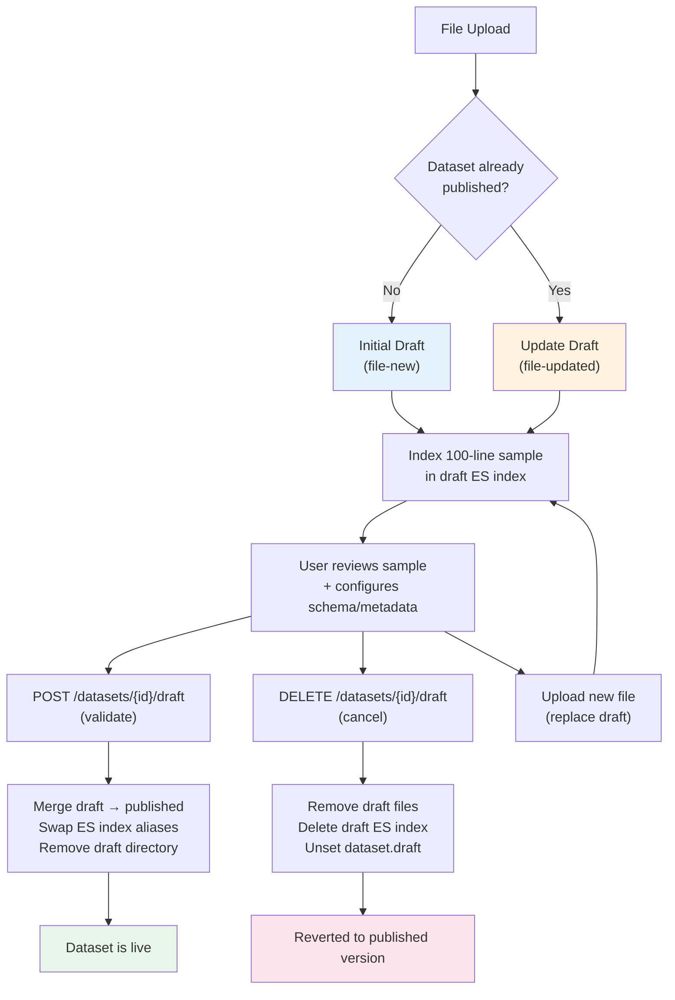
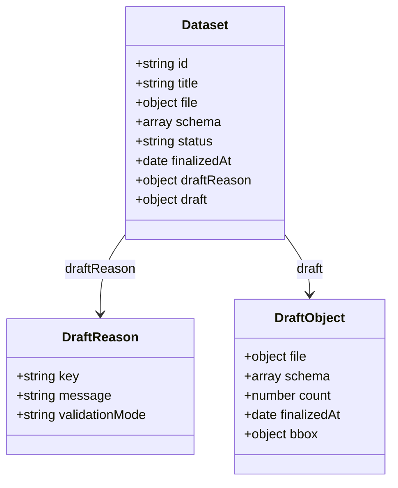
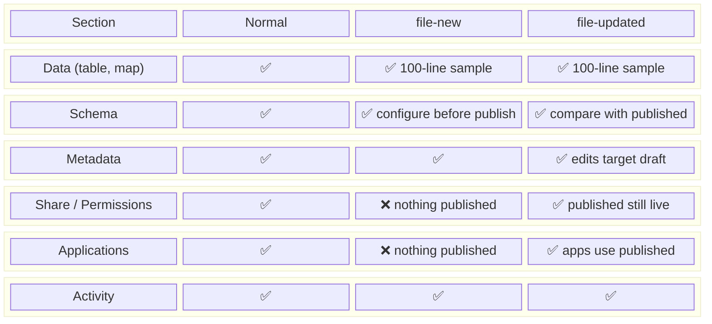

# Dataset Draft Mode

## Overview

File-based datasets can enter a **draft state** when a file is uploaded. The draft system enables users to preview and configure data before it goes live. There are two fundamentally different draft situations:

| | Initial draft (`file-new`) | Update draft (`file-updated`) |
|---|---|---|
| Context | Brand new dataset, never published | Existing dataset, new file uploaded |
| Published version | Does not exist | Still live, serving data |
| Cancel draft | Not possible (delete dataset instead) | Reverts to published version |

## Draft Lifecycle



## Data Model

When a dataset has a draft, `dataset.draft` contains a copy of draft-specific properties (file, schema, count, etc.). The main dataset properties hold the published version (if any).



- `draftReason.key`: `'file-new'` or `'file-updated'`
- `draft.*`: mirrors the main dataset fields but for the draft version
- `finalizedAt` on the main dataset: only set if a published version exists

## API Behavior

### The `?draft=true` parameter

When requesting a dataset with `?draft=true`, the API merges draft state into the response:

```
GET /api/v1/datasets/{id}           → published view (draft fields in dataset.draft)
GET /api/v1/datasets/{id}?draft=true → merged draft view (draft overrides main fields)
```

Both views include `draftReason` when a draft exists, so the UI can always detect draft state.

### Draft-aware PATCH

When `dataset.draftReason` is set, all PATCH operations automatically prefix keys with `draft.`:

```
PATCH /api/v1/datasets/{id}  { title: "New Title" }
  → MongoDB update: { "draft.title": "New Title" }
```

Metadata editing works transparently in draft mode — saves target the draft without affecting the published version.

### Elasticsearch Indexing

Only the first **100 lines** of the draft file are indexed (sample for preview). Draft and published data use separate ES indices:

```
Published: {prefix}-{datasetId}
Draft:     {prefix}_draft-{datasetId}
```

On validation, the draft index is promoted to main via alias swap.

## UI Behavior

### Section Visibility



| Section | Normal | file-new | file-updated |
|---------|--------|----------|--------------|
| Data (table, map) | visible | visible (100-line sample) | visible (100-line sample) |
| Schema | visible | visible (configure before publish) | visible (compare with published) |
| Metadata | visible | visible | visible (edits target draft) |
| Share / Permissions | visible | **hidden** (nothing published) | visible (published still live) |
| Applications | visible | **hidden** (nothing published) | visible (apps use published) |
| Activity | visible | visible | visible |

### Available Actions

| Action | Normal | file-new | file-updated |
|--------|--------|----------|--------------|
| Validate draft | — | publish for first time | replace published version |
| Cancel draft | — | **not available** | discard new file |
| Delete dataset | available | available | available |
| Edit metadata | available | available | available (targets draft) |
| Upload new file | available | replace draft file | replace draft file |

### Dataset Store

The dataset store (`ui/src/composables/dataset-store.ts`) accepts a `draft` parameter that cascades to all API calls. When in draft mode and the draft reason is `file-updated`, the store should also fetch the published version (without `?draft=true`) to enable schema/data comparison.

## Key File References

### Backend
| File | Lines | Purpose |
|------|-------|---------|
| `api/src/datasets/service.js` | 161-174 | Draft merge logic in getDataset |
| `api/src/datasets/service.js` | 484-490 | Draft-aware PATCH logic |
| `api/src/datasets/service.js` | 542-626 | validateDraft (publish) |
| `api/src/datasets/service.js` | 628-630 | cancelDraft |
| `api/src/datasets/router.js` | 557-597 | Draft endpoints |
| `api/src/datasets/middlewares.js` | 74-92 | readDataset middleware |
| `api/src/datasets/es/commons.js` | 94-98 | ES alias for draft index |
| `api/types/dataset/schema.js` | 857-895 | Draft schema definition |

### Frontend
| File | Purpose |
|------|---------|
| `ui/src/pages/dataset/[id]/index.vue` | Main page with sections logic |
| `ui/src/pages/dataset/[id]/edit-metadata.vue` | Metadata editor (works in draft) |
| `ui/src/pages/dataset/[id]/table.vue` | Table page (works in draft) |
| `ui/src/components/dataset/dataset-status.vue` | Draft banner + validate/cancel |
| `ui/src/components/dataset/dataset-actions.vue` | Right panel actions |
| `ui/src/composables/dataset-store.ts` | Store with draft param |
| `ui/src/composables/dataset-lines.ts` | Lines query with draft flag |
