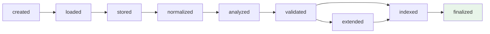
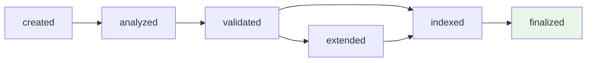
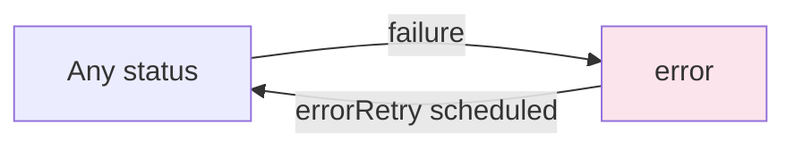

# Dataset Processing Flow

## Overview

When a dataset is created or updated, it goes through a pipeline of worker tasks that transform the raw data into a queryable, indexed resource. Each step updates the dataset's `status` field in MongoDB, and the next worker picks up where the previous one left off.

For file-based datasets that use the draft system, the same pipeline runs under the `draft.*` fields — see [dataset-drafts.md](dataset-drafts.md) for details on the draft lifecycle.

## Status Pipeline

### File-based datasets



The `extended` step is only reached when the dataset has active extensions (geocoding, lookups, etc.). Otherwise the pipeline goes directly from `validated` to `indexed`.

A `validation-updated` status can also trigger re-validation when the schema is modified on an already-analyzed dataset.

### REST datasets

REST datasets skip file-related steps:



### Virtual datasets

Virtual datasets (aggregations of other datasets) only need indexing:


### Error and retry

Any step can fail and set the status to `error`. The `errorStatus` field preserves the previous status so the retry mechanism knows where to resume.



## Worker Architecture

The system uses 4 [Piscina](https://github.com/piscinajs/piscina) thread pools, each tuned for a different workload profile. The `baseConcurrency` is a configuration value (default depends on deployment).

| Worker | Max threads | Concurrency per thread | Memory limit | Purpose |
|--------|-------------|------------------------|-------------|---------|
| `filesManager` | 1 | 2× base | 512 MB | File IO: downloading, storing, initializing |
| `filesProcessor` | baseConcurrency | 1 | 1024 MB | CPU/memory intensive: normalization, analysis |
| `batchProcessor` | 1 | 2× base | 512 MB | Streaming batches: validation, extension, indexing |
| `shortProcessor` | 1 | 4× base | 512 MB | Quick IO tasks: finalize, maintenance |

## Processing Steps

| # | Task | Worker | Input status | Output status | What it does |
|---|------|--------|--------------|---------------|-------------|
| 1 | `initialize` | filesManager | `created` | `loaded` (file), `analyzed` (REST), `indexed` (virtual) | Sets up dataset structure, handles `initFrom`, prepares file metadata |
| 2 | `storeFile` | filesManager | `loaded` | `stored` | Moves file from upload directory to permanent storage, detects encoding |
| 3 | `normalizeFile` | filesProcessor | `stored` (when format needs conversion) | `normalized` | Converts formats (ZIP extraction, shapefile detection, encoding normalization). Skipped when the file is already in a basic type |
| 4 | `analyzeCsv` / `analyzeGeojson` | filesProcessor | `normalized` (or `stored` for basic types) | `analyzed` | Infers schema: detects field types, headers, separators, geographic properties |
| 5 | `validateFile` | batchProcessor | `analyzed` or `validation-updated` | `validated` | Validates data against schema, creates Elasticsearch index with initial data |
| 6 | `extend` | batchProcessor | `validated` (with active extensions) | `extended` | Applies extension remotes (geocoding, enrichment, expression evaluation) |
| 7 | `indexLines` | batchProcessor | `validated`/`extended` | `indexed` | Streams all data lines into Elasticsearch, builds search indices |
| 8 | `finalize` | shortProcessor | `indexed` | `finalized` | Calculates field cardinality and enums, bounding box, temporal coverage, sets `finalizedAt` |

## Task Scheduling and Execution

### Polling and ping

Workers run in a continuous loop. A MongoDB **capped collection** (`ping-workers`) acts as a lightweight event queue: when a dataset's status changes, a ping is emitted via a tailable cursor so workers don't have to wait for the next polling interval.

### Task selection

Each worker type defines a MongoDB filter (see `api/src/workers/tasks.ts`) that matches datasets ready for its step. The orchestrator (`api/src/workers/index.ts`):

1. Checks available slots in each worker pool
2. Queries MongoDB for the next dataset matching the task filter
3. Acquires a distributed lock on the dataset (lock key: `datasets:{id}`)
4. Dispatches the task to the appropriate Piscina pool
5. On completion: updates dataset status, logs journal event, releases lock
6. On failure: sets `status: 'error'`, schedules retry if applicable

### Fair allocation

Fair allocation is controlled by the `worker.concurrencyLimitPerAccount` config (env var `WORKER_CONCURRENCY_LIMIT_PER_ACCOUNT`), the fraction of a worker's slots a single account/owner may use concurrently:

- **`1` (default)** — full concurrency: a single owner can use every slot. The fair-allocation rules below are disabled. Suitable for small mono-organization deployments where all slots must be usable.
- **`< 1` (e.g. `0.5`)** — on shared multi-organization deployments, to prevent a single owner from monopolizing workers:
  - No owner can use more than that fraction (e.g. **50%**) of a worker's available slots
  - The last available slot is reserved for a different owner

These rules only apply to workers with at least 2 slots.

### Draft priority

When both a published dataset and a draft dataset need processing, draft tasks are prioritized to give users faster feedback.

## Error Handling

When a task fails:
- `status` is set to `error`
- `errorStatus` stores the previous status (so retry knows where to resume)
- `errorRetry` is set to a future timestamp for automatic retry

Exceptions:
- Errors prefixed with `[noretry]` are never retried (permanent failures)
- A second consecutive error on the same step prevents further retries

Journal events: `error` for permanent failures, `error-retry` for retriable ones.

## Task Progress

Alongside journal events, workers publish a live progress indicator consumed by the UI task
loader (`GET /datasets/{id}/task-progress`, shown in the right-hand navigation, the status card
and the journal view).

- State lives in a single `taskProgress` field on the dataset's `journals` document
  (`{ task, progress, error? }`) — one per dataset, shared between draft and published
  processing. Every update is also pushed on the `datasets/{id}/task-progress` websocket
  channel (`api/src/datasets/utils/task-progress.ts`).
- `progress` is `-1` (indeterminate) right after a task starts, then a 0-100 percentage,
  throttled to at most one write per 250ms.
- On success a non-final task leaves `{ task, progress: 100 }`, immediately superseded when the
  next task starts. `finalize` — or any task flagged `finalTask`, such as the validate step of
  a draft cancelled by the worker itself — clears the field entirely.
- **On failure the field is intentionally kept**, as `{ task, progress, error: true }`: while
  the dataset sits in `error` status the UI shows which task failed (red bar) and how far it
  got. It is overwritten as soon as reprocessing starts (constraint dropped, new file
  uploaded, retry...).
- Corollary: a terminal transition that discards the errored work *without running another
  worker* must clear the field explicitly, or the failed task would be displayed forever. The
  one such transition is user-initiated draft cancellation (`DELETE /datasets/{id}/draft`),
  which calls `clearTaskProgress` — e.g. a draft that failed the unicity gate during `index`
  and is then cancelled reverts to the healthy published version with an empty task loader.

## REST Dataset Partial Updates

REST datasets can receive incremental data updates while remaining in `finalized` status. The `_partialRestStatus` field tracks progress through a mini-pipeline:

```
finalized + new data → _partialRestStatus: 'updated'
    → extend (if active extensions) → _partialRestStatus: 'extended'
    → indexLines → _partialRestStatus: 'indexed'
    → finalize → _partialRestStatus: null
```

This allows the dataset to stay queryable while new data is being processed.

## Maintenance Tasks

These run on finalized datasets as background housekeeping:

| Task | Worker | Trigger | What it does |
|------|--------|---------|-------------|
| `renewApiKey` | shortProcessor | `readApiKey.renewAt` has passed | Renews the dataset's read API key |
| `manageTTL` | shortProcessor | REST dataset with active TTL, checked >1h ago | Applies time-to-live cleanup on old data |
| `autoUpdateExtension` | shortProcessor | REST dataset with extension `nextUpdate` passed | Re-runs extensions that need periodic refresh |

## Key File References

### Worker system
| File | Purpose |
|------|---------|
| `api/src/workers/index.ts` | Main orchestrator: event loop, locking, concurrency control |
| `api/src/workers/tasks.ts` | Task definitions and MongoDB filters |
| `api/src/workers/types.ts` | TypeScript types |
| `api/src/workers/ping.ts` | Ping event queue (MongoDB capped collection) |

### Worker implementations
| File | Tasks |
|------|-------|
| `api/src/workers/files-manager/initialize.ts` | `initialize` |
| `api/src/workers/files-manager/store-file.ts` | `storeFile` |
| `api/src/workers/files-processor/normalize.ts` | `normalizeFile` |
| `api/src/workers/files-processor/analyze-csv.ts` | `analyzeCsv` |
| `api/src/workers/files-processor/analyze-geojson.ts` | `analyzeGeojson` |
| `api/src/workers/batch-processor/validate-file.ts` | `validateFile` |
| `api/src/workers/batch-processor/extend.ts` | `extend` |
| `api/src/workers/batch-processor/index-lines.ts` | `indexLines` |
| `api/src/workers/short-processor/finalize.ts` | `finalize` |

### Related
| File | Purpose |
|------|---------|
| `shared/statuses.json` | Status display labels and icons |
| `shared/events.json` | Journal event definitions (start/end per step) |
| `api/src/datasets/utils/task-progress.ts` | Task progress persistence + websocket emission, `clearTaskProgress` |
| `ui/src/components/dataset/dataset-task-progress.vue` | UI task loader consuming `GET /task-progress` |
| `api/src/datasets/service.js` | Dataset CRUD, patch logic, draft merge |
| `api/src/datasets/router.js` | HTTP endpoints, triggers worker pings |
