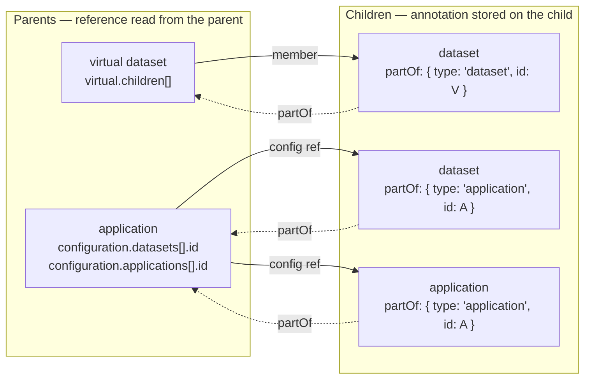
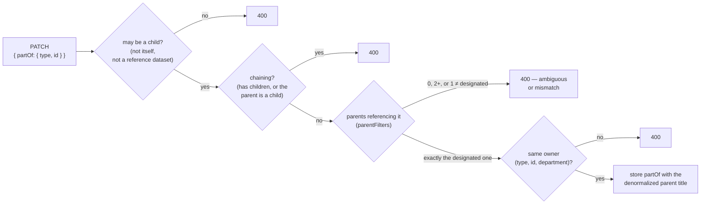
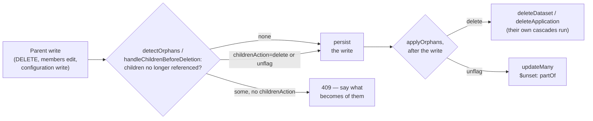
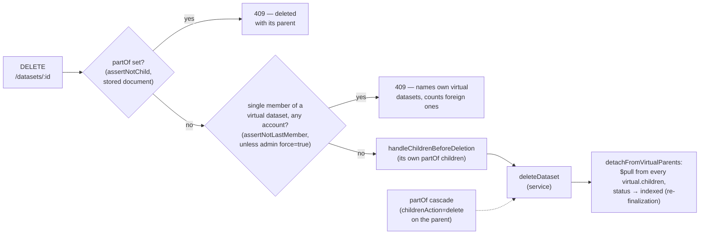

# Parent resources (`partOf`)

`partOf` is an optional annotation on a dataset or an application declaring it the **child** of the single parent resource it only exists to serve: a dataset feeding one dashboard, a sub-visualization embedded in one dashboard. A child is hidden from the back-office listings, stays reachable from its parent, and shares its parent's lifecycle — it moves with it, and it is deleted with it, never on its own.

The whole feature is generic. It knows about two resource *types* (`dataset`, `application`) and about nothing else: no combination of types is forbidden a priori, and the API never gates on "is this a virtual dataset" or "is this a dashboard". What varies per type — *how* a parent happens to reference its children — lives in a single link table in `shared/utils/parent-children.ts`. The rules live in `api/src/misc/utils/part-of.ts`.

## 1. Data model

A child carries one weak resource ref, the shape the model already stores elsewhere:

```js
partOf: { type: 'application', id: 'abcd1234', title: 'My dashboard' }
```

- `type` + `id` are the link. It is a **weak** reference: no foreign key, no index, nothing guarantees the parent still exists (see §7).
- `title` is a denormalized display copy, always written server-side from the parent's current title — never trusted from the client.
- **A single parent.** The field is not an array; the "exactly one parent" invariant is checked when the annotation is defined (§2).
- The shape is declared once in `api/contract/part-of.js` and reused verbatim by `api/types/dataset/schema.js` and `api/types/application/schema.js` — nothing in it varies per resource type. Patching `partOf: null` unflags the resource (`$unset`).

### The link table

`shared/utils/parent-children.ts` is the only place that knows how a resource references another one. Three links exist today:

| Parent | Child | Read from | Mongo path |
|---|---|---|---|
| dataset (virtual only) | dataset | `virtual.children` | `virtual.children` |
| application | dataset | `configuration.datasets[].id` | `configuration.datasets.id` |
| application | application | `configuration.applications[].id` | `configuration.applications.id` |

Solid arrows are the references the parents already hold (what the link table reads); dotted arrows are the annotation stored on the child:



Both directions are resolved from that table — `childRefs()` (what a parent references, applied as well to a stored resource as to an unsaved edit: a configuration draft, the members being added to a virtual dataset), `parentFilters()` (the mongo filters matching the parents of a given child), `orphanRefs()` (what a new version of a parent would stop referencing). Adding a new way to relate two resources means adding one line to that table; nothing else in the feature changes. The UI warnings and the API guards compare the same two sides through the same helpers.

## 2. Definition-time rules

`prepareAtDefinition()` runs when a patch defines an **existing** resource as a child. It works on the effective view (stored document + patch) and enforces:

1. not its own child;
2. the resource may be a child at all — the single type-specific constraint, `cannotBeChild`: a reference dataset (`masterData`) may not, because it exists to be reused across many contexts rather than to serve one parent (the reciprocal — a child cannot become reference data — is guarded in `datasets/utils/patch.ts` against the *effective* `partOf`, so an unrelated patch on a legacy document holding both is not locked);
3. it has no `partOf` children of its own, and the designated parent is not itself a child — **chains are forbidden in both directions**, because they would leave silent orphans behind a cascading deletion;
4. it is referenced by **exactly one** parent resource (0 or 2+ makes the relationship ambiguous) and that parent is the one the patch designates;
5. parent and child live in the **same account** — `isSameOwner`, which treats a department as a distinct scope (`owner.type`, `owner.id` and `owner.department` must all match) — so a cascading deletion can never reach another account.

Then the parent's title is denormalized onto the ref.



### Creation directly under a parent

A child may also be **created** under its parent (`prepareAtCreation()`, from `datasets/service.ts` `createDataset` and the application creation branch of `PUT /applications/:id`). The parent cannot reference a resource that does not exist yet, so rule 4 is replaced by a permission check on the parent (§3). Rules 2, 3 and 5 still apply.

## 3. Permissions

- **`writePartOf`** is a new **admin-class** operation on both datasets and applications (`shared/permissions/operations.ts`). Both PATCH routes gate on `'partOf' in req.body`, so only a patch that touches the field requires it. Subordinating a resource that already stands on its own — or releasing it — is an admin act on that resource.
- **Creation under a parent** is deliberately *not* admin-gated: it requires a **write-class** right on the parent, the very write that would make it reference the child (`canReferenceChild`) — `writeDescriptionBreaking` for a virtual dataset parent (a member is added by patching `virtual`), and `writeConfig` **or** `writeDescription` for an application parent (its configuration is written by two routes gated by two different operations; the disjunction is deliberate, tightening it to `writeConfig` would 403 integrators). Creating a child that never stood on its own is not an admin act, and whoever holds that right can unflag the child again by dropping it from the parent.
- **The cascades check nothing per child.** A child exists only to serve its parent, so whoever can authorize the operation on the parent decides what becomes of the children.
- A **full-replace `PUT /applications/:id`** uses neither gate, so it preserves the stored `partOf` and ignores the one in the body: the field is PATCH-only on an existing resource.

## 4. Visibility

`listFilter()` is applied by `GET /datasets` and `GET /applications`:

- default: `{ 'partOf.id': { $exists: false } }` — children are excluded from browsing;
- `?partOf=true` — only children; `?partOf=<parentId>` — only the children of that parent;
- **exempted params**: when the query carries a targeted-fetch param the filter is dropped entirely — `id`, `ids`, `slug`, `slugs`, `children` for datasets, `id`, `ids`, `dataset`, `application` for applications. Those are lookups by known id/slug and reverse-lookups ("which parents reference me"), not browsing, and must keep working on a resource that happens to be someone's child.

No index was added for the children lookups (`partOf.type` + `partOf.id`); see §7.

**Quotas.** A child only exists for its parent, so it does not count in the account's `nb_datasets` limit — neither at creation (`POST /datasets` with `partOf` skips the "before upload" check) nor when it follows its parent to another account (`checkMoveLimits`). It counts like any dataset in `store_bytes` and `indexed_bytes`. `updateTotalStorage` excludes children from the count and is re-run whenever a dataset's `partOf` changes (define, unflag, cascades).

## 5. Lifecycle

### The parent stops referencing its children

Two situations, one cascade. Deleting a parent (`handleChildrenBeforeDeletion`) or persisting a version of it that no longer references defined children (`detectOrphans`: a virtual dataset's members edit, an application configuration write through PATCH or `PUT /config[uration]`) **returns 409** unless the request says what becomes of the children, with `?childrenAction=`:

- `delete` — the children are deleted through their own service function, so their own cascades keep running;
- `unflag` — `updateMany $unset: { partOf: 1 }`, the children survive as standalone resources.



Detection and application are deliberately separate for the editing case: the cascade is irreversible, so it only runs **once the write that orphans the children is persisted** (`applyOrphans` after `applyPatch`). A rejected write never deletes anything.

### The parent changes account

A child cannot change account on its own (`assertOwnerChangeAllowed`, 409): it can only follow its parent. The parent's change-owner route moves its children along (`changeChildrenOwner`), and the moved child **datasets** are counted against the new account's storage limit first (`checkMoveLimits` — not against its number of datasets, see §4). Chains being forbidden, the recursion terminates at depth one.

### The child is deleted directly

Refused: `assertNotChild` (409) on `DELETE /datasets/:id` and `DELETE /applications/:id`. Only the delete *routes* call it — the cascades go through the services, which is how `childrenAction=delete` still works. On the dataset route the guard reads `reqDatasetFull` rather than `reqDataset`, which can be the draft view (`alwaysDraft`).

### A virtual dataset keeps a member

A virtual dataset with no member cannot be queried, so three guards keep it non-empty and consistent, all in `datasets/utils/virtual.ts`:

- `assertKeepsAMember(dataset, patch)` — a PATCH may not empty a virtual dataset that already aggregates at least one member (400). Creating one with zero members, or patching an already-empty one, stay allowed. Checked *before* `detectOrphans`, so the user is not asked for a `childrenAction` on a patch that will be rejected anyway.
- `assertNotLastMember(dataset, sessionState, force)` — deleting the **single member** of a virtual dataset is refused (409), **whoever owns the virtual dataset**: a dataset others have built on is not deleted without a check. Virtual datasets of the same account (any department) are named; foreign ones are only counted ("N jeu(x) … d'autres comptes"), so nothing leaks across accounts. In **admin mode** the message lists them all with their owner, and `?force=true` skips the guard (the detach then empties them). Note that the API lets a virtual dataset aggregate any dataset its owner can read — a public one included — while the UI picker only offers the account's own datasets and the reference data declared for virtual datasets: a public dataset can therefore be locked through the API by a stranger's virtual dataset, and only a superadmin can unlock it.
- `detachFromVirtualParents(datasetId)` — after a dataset is deleted, `$pull` its id from every virtual dataset referencing it and bump their status to `indexed`, which re-finalizes them over the remaining members. Unlike the guard this is **account-agnostic**: a dangling reference is cleaned up whoever owns the parent. It runs only for the stored document, not for a draft (the delete route calls `deleteDataset` twice when a draft exists).

The order of the guards on the dataset delete route, and where the cascade joins:



## 6. Integrity classification

`partOf` is in integrity's metadata denylist (`EXCLUDED_TOP_LEVEL`, `api/src/integrity/operations.ts`) — not as operational churn like its neighbours, but because the unflag cascade writes it raw (`updateMany $unset`) outside `applyPatch`, so covering it would false-breach on every organic cascade. Tampering with `partOf` is therefore not detected; see [integrity.md](integrity.md) §5.

The `virtual` field, by contrast, **is** covered, and `detachFromVirtualParents` writes it raw. That is safe for one structural reason only: a virtual dataset can never be integrity-enrolled (it is neither a file nor a rest dataset, see `integrity/service.ts` `enableIntegrityUnlocked`).

## 7. Known limits

- **The single-parent invariant is kept after definition time** by `assertNoForeignChildren`, called by every parent write (virtual members edit and creation, application configuration writes and creation): a parent may not start referencing a resource already defined as the child of another one (400). Only the refs the write adds are checked, so a legacy state never blocks an unrelated edit — and is not repaired either.
- **`partOf` follows the draft rule of every other metadata.** While a file draft is pending, every PATCH — title and description included — lands under `dataset.draft` and only becomes effective when the draft is validated (see [dataset-drafts.md](dataset-drafts.md)); `partOf` is no exception, and the feature reads the published document like the listings do. A never-published draft-only dataset also never detaches from a virtual parent (it cannot be a member of one in practice).
- **The last-member guard counts references, not live members.** It reads `virtual.children`, so a legacy dangling ref (a member deleted before the detach existed) counts as a member and can let the real last one be deleted.
- **No index on the children lookup.** `partOf.type` / `partOf.id` are unindexed, and the lookup now runs on every resource deletion and every application configuration write.
- **A benign race.** A child that bumps a parent deleted right after may leave an orphan journal document behind.

## 8. UI surface

- `ui/src/components/common/part-of-section.vue` — the "Parent resource" block in the danger zone of the dataset and application pages (rendered when `writePartOf` is granted), with the parent link and the define/unflag button.
- `ui/src/components/common/part-of-dialog.vue` — the guided dialog; the candidates are the resources that currently reference this one, fetched by the page. The UI only offers the relations that make sense today (an application parent for a dataset or an application, a virtual dataset parent for its members).
- `ui/src/components/common/children-action-dialog.vue` — the delete-vs-unflag choice, raised before every operation that would orphan children (resource deletion, virtual members edit, application configuration write).
- On a child, the danger zone hides the change-owner and delete entries (the API refuses both) and keeps only the parent-resource block; the parent is linked from the info block (`dataset-metadata-details.vue`).
- `ui/src/components/dataset/dataset-virtual.vue` hides the remove-member icon and shows a hint when a virtual dataset is down to its last member.
- The dataset delete dialog lists the visible virtual datasets this one is the single member of (`virtualDatasetsFetch`, `children=<id>`) and blocks the confirmation; in admin mode a "force" checkbox sends `?force=true`. Foreign virtual datasets a regular user cannot see are caught by the API 409.

## 9. Quick map of the relevant files

- `api/src/misc/utils/part-of.ts` — every rule and cascade; the header comment states the model.
- `shared/utils/parent-children.ts` — the link table and the generic resolution helpers, shared by the API and the UI.
- `api/src/datasets/routes/metadata.ts` — dataset PATCH gate, change-owner and DELETE guards, orphan detection/application.
- `api/src/applications/router.ts`, `api/src/applications/middlewares.ts`, `api/src/applications/service.ts` — the same for applications, plus the creation branch and the full-replace preservation.
- `api/src/datasets/utils/patch.ts` — the `masterData` mutual exclusion and the definition-time hook.
- `api/src/datasets/utils/virtual.ts` — the three virtual-dataset guards and the detach.
- `api/src/datasets/utils/storage.ts` — `checkMoveLimits`, shared by both change-owner routes.
- `shared/permissions/operations.ts` — declares `writePartOf` in the admin class of both resource types.
- `tests/features/datasets/part-of.api.spec.ts`, `tests/features/applications/part-of.api.spec.ts`, `tests/features/datasets/virtual/virtual-last-member.api.spec.ts`, `tests/features/datasets/virtual/virtual-member-deletion.api.spec.ts` — the behavior contract.
