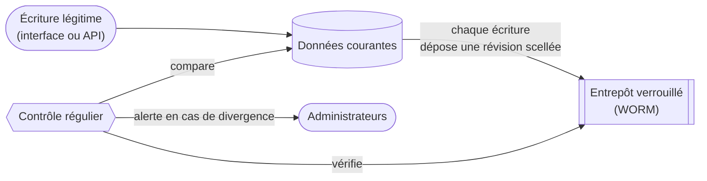

## Introduction

Le contrôle d'intégrité de data-fair répond à une question simple : **comment prouver que des données n'ont pas été altérées en dehors des circuits légitimes, et comment revenir en arrière si cela s'est produit ?**

La fonctionnalité s'articule autour de trois niveaux d'exigence, dont les deux premiers sont couverts :

1. **Détection** — savoir qu'une ressource a été modifiée hors du circuit d'écriture légitime, même par une personne disposant d'accès techniques directs.
2. **Réparation** — pouvoir restaurer la ressource dans n'importe quel état antérieur vérifié, dans la limite d'une fenêtre de rétention.
3. **Prévention** — rendre une ressource immodifiable. Ce niveau n'est pas couvert par cette fonctionnalité : la plateforme reste un outil de gestion de données vivantes, et l'immuabilité totale relèverait d'un dispositif distinct.

Le principe central : chaque écriture légitime dépose une **révision scellée** — empreinte numérique, contexte de l'opération et copie complète du contenu — dans un **entrepôt à verrouillage de conformité** (stockage objet WORM, *Write Once Read Many*), où personne, pas même l'hébergeur de la plateforme, ne peut la modifier ni la supprimer avant l'échéance de son verrou. Un contrôle régulier compare l'état courant des données à la dernière révision scellée, et vérifie également que l'historique de révisions lui-même n'a pas été manipulé.

Ce document s'adresse aux directions des systèmes d'information, aux responsables de la sécurité et aux auditeurs qui évaluent la fonctionnalité. Il présente les garanties offertes et leurs limites, le périmètre couvert, le fonctionnement concret dans l'interface, et les éléments de conformité — de façon synthétique, sans renvoyer au détail technique de l'implémentation.
