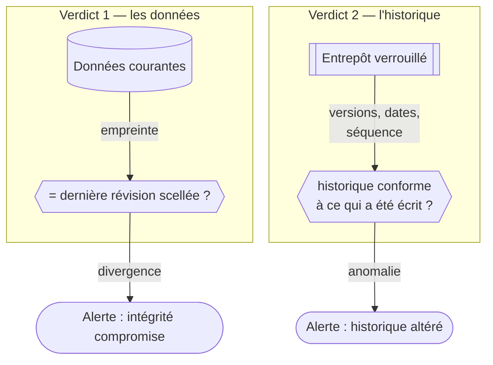

## Garanties et niveaux de confiance

Cette section énonce ce qui est garanti, contre qui, et avec quelle force. Le parti pris est l'**inviolabilité par la preuve** : la fonctionnalité ne prétend pas empêcher toute altération, elle garantit qu'une altération laisse une trace impossible à effacer, et que l'état vérifié reste toujours restaurable.

### La racine de confiance : le verrou de conformité

Toutes les garanties reposent sur une propriété unique, fournie par le stockage objet sous-jacent : le **verrouillage en mode conformité**. Une révision écrite dans l'entrepôt ne peut être ni modifiée ni supprimée avant l'échéance de son verrou — par personne, y compris le titulaire du compte de stockage et l'exploitant de la plateforme. Ce n'est pas un contrôle d'accès logiciel que l'on pourrait contourner : c'est une propriété du service de stockage lui-même, vérifiée sur le fournisseur cible.

Deux conséquences structurent tout le reste :

- une révision scellée est un **fait acquis** : elle témoigne de l'état des données à un instant donné, et ce témoignage survit à toute compromission ultérieure ;
- la plateforme n'a pas besoin d'être crue sur parole : les mécanismes de détection ne font que **lire des preuves** que l'entrepôt détient déjà.

### Le double verdict

Chaque contrôle répond à deux questions indépendantes :

1. **Verdict d'intégrité des données** — l'état courant (fichier, métadonnées, lignes) correspond-il à la dernière révision scellée ? Une divergence signifie qu'une écriture a eu lieu hors du circuit légitime.
2. **Verdict de cohérence de l'historique** — l'historique de révisions lui-même est-il bien celui que la plateforme a écrit ? Ce second verdict détecte les manipulations de l'entrepôt : révision masquée, réécrite par-dessus, datée de façon incohérente, ou trou dans la séquence. Il s'appuie sur des éléments que même un détenteur des accès de stockage ne peut pas falsifier : les versions verrouillées d'origine et les dates apposées par le fournisseur de stockage.

### Niveaux de confiance selon l'adversaire

| Position de l'adversaire | Ce qu'il peut faire | Ce qui est garanti |
|---|---|---|
| **Modification directe des données** (accès aux fichiers ou à la base interne, en contournant la plateforme) | Altérer, insérer ou supprimer des données | **Détection** au prochain contrôle, **réparation** depuis la dernière révision vérifiée |
| **Idem, en imitant le signal d'écriture interne** (compromission avancée de la base) | Faire enregistrer son altération comme une écriture ordinaire | L'altération entre dans l'historique, **datée et horodatée** ; le croisement entre l'historique de révisions et le journal d'activité de la plateforme révèle une écriture sans action correspondante. C'est la limite dite du « mensonge à la première écriture » : l'historique prouve *qu'une* écriture a eu lieu et *quand*, pas *qui* en est l'auteur légitime |
| **Accès aux identifiants de l'entrepôt de révisions** (vol de clés de stockage) | Tenter de masquer, réécrire ou fabriquer des révisions | Les révisions d'origine sont **indestructibles** avant échéance ; toute tentative de dissimulation est **détectée par le verdict de cohérence de l'historique**, car elle laisse des traces impossibles à effacer (versions superposées, dates du fournisseur) |
| **Désarmement de la protection** (désactivation hors circuit du contrôle) | Couper la surveillance avant d'altérer | Toute désactivation légitime est elle-même **enregistrée dans l'historique** ; une surveillance quotidienne croise l'entrepôt et la base et **alerte** quand une protection s'arrête sans désactivation signée |
| **Collusion de l'exploitant et du fournisseur de stockage** | Détruire l'entrepôt et ses preuves | **Hors modèle de menace**, assumé et documenté : s'en prémunir exigerait des preuves cryptographiques indépendantes du fournisseur, écartées par choix de conception |

### La robustesse des alertes

Détecter ne suffit pas si l'alerte peut être étouffée. Les événements d'alerte (intégrité compromise, historique altéré, échec de renouvellement de verrou, incohérence de protection) sont émis **à l'entrée dans l'état anormal puis réémis périodiquement tant qu'il persiste** : un adversaire qui parviendrait à supprimer une notification ne gagne qu'un délai, jamais le silence. Symétriquement, un jeu de données protégé qui reste trop longtemps **sans verdict définitif** — écritures en attente, incident technique, ou blocage provoqué — déclenche sa propre alerte : l'absence de réponse est traitée comme une anomalie, pas comme un état neutre.

### Ce que la fonctionnalité ne garantit pas

Par honnêteté d'évaluation, les limites assumées :

- **pas de prévention** : une altération reste matériellement possible ; elle est détectée et réparable, pas empêchée ;
- **pas d'imputation individuelle *permanente* dans l'historique** : la révision scellée elle-même n'enregistre que la *catégorie* d'auteur (utilisateur, superadministrateur, traitement interne…), jamais l'identité — un choix délibéré lié à la protection des données personnelles (voir la section conformité), parce que le verrou d'une révision peut glisser indéfiniment tant que la ressource est vivante. L'identité, quand elle est capturée, est conservée à part, dans une **attribution bornée dans le temps** (retenue 180 jours, jamais prolongée — voir la section conformité) ; au-delà, seul le journal d'activité de la plateforme la porte, avec son propre cycle de vie ;
- **pas de non-répudiation cryptographique** : pas de chaînage de signatures ni d'horodatage qualifié ; la confiance repose sur le verrou de conformité du stockage ;
- **l'historique est borné** : seule la fenêtre de rétention (un an par défaut) est restaurable ; l'état *courant* vérifié, lui, reste protégé indéfiniment tant que la protection est active.

### Une discipline de processus complémentaire : l'écriture réservée aux clés d'API

Indépendamment des garanties ci-dessus, un jeu de données peut être configuré pour n'accepter d'écriture (interface comprise) que via une **clé d'API** — y compris pour les actions superadministrateur courantes. Ce n'est **pas une extension du modèle de menace** : cela ne rend rien plus difficile à falsifier techniquement. C'est une discipline opérationnelle — aucune modification accidentelle depuis l'interface, chaque écriture légitime rattachée à un identifiant révocable — qui, combinée à l'attribution ci-dessus, rend le rapprochement entre l'historique et le journal d'activité quasi mécanique sur un jeu de données ainsi verrouillé.
