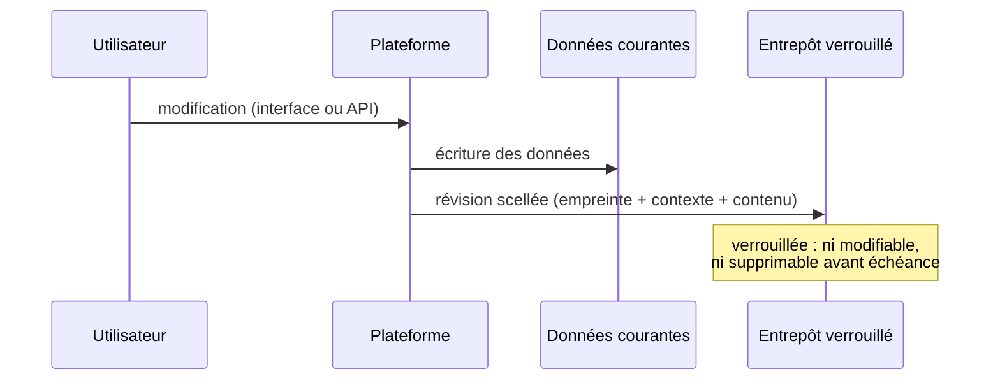
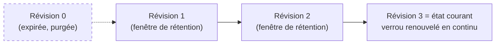

## Fonctionnement

### L'activation

La protection s'active **jeu de données par jeu de données**, par un superadministrateur de la plateforme. À l'activation, l'état courant est immédiatement scellé : c'est la première révision, la référence de tous les contrôles à venir. Pour un jeu de données éditable, chaque ligne reçoit en outre sa propre séquence de révisions (voir le périmètre).

L'activation est refusée quand la garantie ne pourrait pas être tenue entièrement — plutôt que d'accepter avec des réserves en petits caractères, la règle est : **couvert intégralement, ou pas enrôlé** (détail dans la section périmètre).

### Chaque écriture légitime scelle une révision

Toute modification passant par la plateforme — remplacement du fichier, modification de métadonnées, écriture d'une ligne — dépose une nouvelle révision dans l'entrepôt verrouillé : l'empreinte numérique du nouvel état (SHA-256), le contexte de l'opération (nature, catégorie d'auteur, date, éventuel motif saisi par l'administrateur), et la **copie complète du contenu** qui rend la restauration possible. L'enregistrement est conçu pour qu'aucune panne ne puisse séparer l'écriture de sa révision : soit les deux aboutissent, soit la divergence est visible et signalée.

Les fichiers identiques ne sont jamais stockés deux fois : une modification qui ne touche que les métadonnées référence la copie déjà scellée du fichier. Le coût de stockage croît donc avec le nombre de *versions distinctes du fichier*, pas avec le nombre de révisions — et il est **décompté du quota de stockage du compte**, comme le reste de ses données.

### Le contrôle et l'alerte

Un contrôle automatique passe chaque nuit sur les jeux de données protégés ; un contrôle immédiat peut aussi être déclenché à la demande depuis l'interface. Chaque passage produit les deux verdicts (données et piste, voir les garanties) et alerte les administrateurs abonnés via le système de notifications de la plateforme en cas d'anomalie — avec la logique de réémission périodique décrite dans les garanties.

### La rétention et l'horizon de protection

Chaque révision est verrouillée pour la **fenêtre de rétention** (un an par défaut, configurable au niveau du déploiement — extensible, jamais réductible rétroactivement). Cette fenêtre joue deux rôles :

- **l'horizon de protection** : tant qu'un jeu de données vit, le verrou de sa dernière révision est **renouvelé automatiquement** avant échéance, de sorte que l'état courant vérifié reste protégé indéfiniment. Un échec de renouvellement déclenche une alerte : c'est le seul chemin par lequel la garantie pourrait s'éteindre en silence, il est donc traité avec la même gravité qu'une compromission ;
- **la profondeur d'historique** : les révisions plus anciennes expirent à l'échéance de leur verrou et sont alors purgées. On peut restaurer n'importe quel état des douze derniers mois, pas au-delà.

### La fin de vie : désactivation et suppression

La désactivation de la protection et la suppression d'un jeu de données protégé sont elles-mêmes **des événements enregistrés dans la piste** : une révision terminale signée clôt la séquence, avec l'éventuel motif saisi. Les révisions existantes restent verrouillées jusqu'à leur échéance puis s'effacent naturellement — la suppression complète de l'historique intervient donc au plus tard une fenêtre de rétention après la fin de vie. Une surveillance quotidienne vérifie qu'aucune protection ne s'est arrêtée **sans** cette clôture signée : c'est la parade au scénario « couper l'alarme avant d'agir ».

### La restauration et la réconciliation

Deux remèdes, tous deux réservés au superadministrateur et systématiquement tracés dans la piste :

- **Restaurer** ramène le jeu de données (ou ses lignes divergentes) à l'état d'une révision vérifiée — n'importe laquelle de la fenêtre de rétention, pas seulement la dernière. La restauration d'un fichier repasse par le circuit de traitement standard de la plateforme, avec ses validations habituelles.
- **Réconcilier** fait l'inverse : après vérification humaine qu'une divergence correspond à une modification connue et assumée, l'état *courant* est scellé comme nouvelle référence. La divergence cesse d'être signalée, mais l'opération de réconciliation — et son motif — restent lisibles dans l'historique pour toujours.

Dans les deux cas, l'action laisse sa propre révision : **une remédiation ne fait jamais disparaître la trace de ce qu'elle corrige**.
