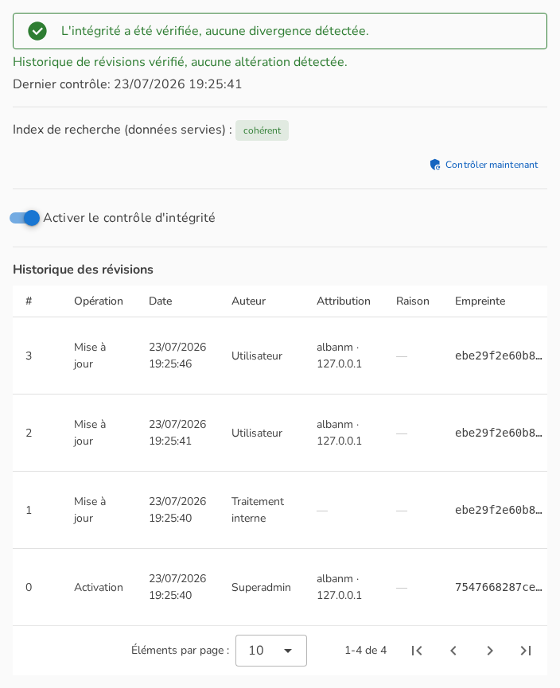
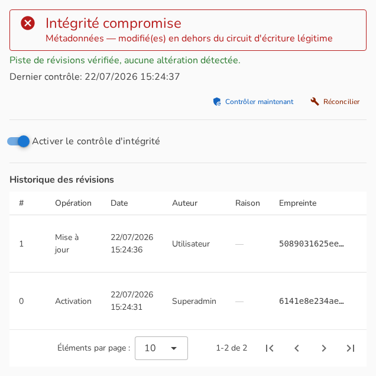
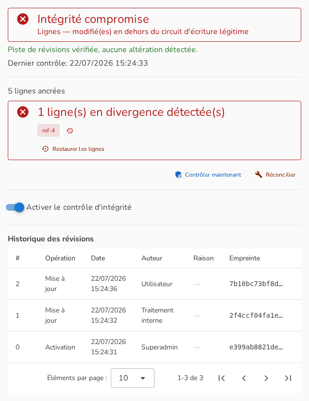

## Utilisation dans l'interface

Toute la fonctionnalité se pilote depuis l'onglet **Intégrité** de la page d'administration du jeu de données. L'onglet est visible par les administrateurs du compte propriétaire ; les actions qui modifient la protection ou l'historique (activer, désactiver, contrôler, réconcilier, restaurer, acquitter) sont réservées au **superadministrateur** de la plateforme et confirmées par des boîtes de dialogue qui énoncent leurs conséquences.

### L'état nominal

Le panneau affiche le verdict du dernier contrôle, la vérification de cohérence, et l'historique complet des révisions : numéro, opération, date, catégorie d'auteur, motif éventuel et empreinte. Quand l'attribution est disponible pour une révision — voir la section conformité —, une colonne dédiée affiche l'identifiant utilisateur ou de clé d'API, l'adresse IP et le pays, sans jamais résoudre ces identifiants en nom affiché. Chaque révision porteuse de contenu propose la comparaison avec l'état courant, le téléchargement du fichier scellé, et la restauration.

### En cas de divergence

Quand un contrôle détecte une écriture hors circuit, le panneau bascule en alerte : la ou les parties touchées (fichier, métadonnées, lignes) sont nommées, et les remèdes sont proposés — comparer l'état courant avec la dernière révision saine, **restaurer** l'état vérifié, ou **réconcilier** si la modification s'avère légitime après enquête. Le jeu de données remonte aussi dans le filtre « en erreur » de la liste des jeux de données, et les administrateurs abonnés reçoivent la notification.

### Jeux de données éditables : la vue par lignes

Pour un jeu éditable, le panneau ajoute le décompte des lignes protégées et, en cas de divergence, la liste des lignes concernées avec l'accès à l'**historique individuel de chaque ligne** — ses révisions successives, leurs différences, sa suppression éventuelle. La restauration des lignes divergentes s'effectue en une action : les lignes modifiées ou supprimées hors circuit sont remises à leur dernier état vérifié, les lignes insérées hors circuit sont retirées.

### L'alerte de cohérence et l'acquittement

Si le second verdict détecte une manipulation de l'entrepôt lui-même (révision masquée ou réécrite, incohérence de dates), une alerte distincte l'affiche avec le détail de chaque anomalie et son niveau de certitude. Après enquête — typiquement : rotation des accès de stockage, vérification des sauvegardes — le superadministrateur peut **acquitter** les anomalies examinées. L'acquittement est lui-même une révision scellée, motivée et datée : il fait taire les anomalies passées en revue, jamais les futures — toute nouvelle manipulation ressort immédiatement.

### Le verrou d'écriture réservé aux clés d'API

Un bouton dédié du panneau (superadministrateur, avec boîte de dialogue de confirmation) active ou désactive l'exigence d'une clé d'API pour toute écriture sur le jeu de données. Tant qu'il est actif, un indicateur visible rappelle la contrainte partout où une action d'écriture serait normalement proposée depuis l'interface à une session utilisateur ordinaire.

### Ce qu'en voit un auditeur

L'historique des révisions se lit comme un registre : qui-catégorie a fait quoi, quand, et pourquoi quand un motif a été saisi. Les motifs libres saisis lors des restaurations, réconciliations, désactivations et acquittements y sont conservés à demeure — ce qu'un administrateur peut écrire, un auditeur peut le lire. Le croisement avec le journal d'activité de la plateforme (qui, lui, porte les identités) permet de rattacher chaque révision à une action individuelle.
